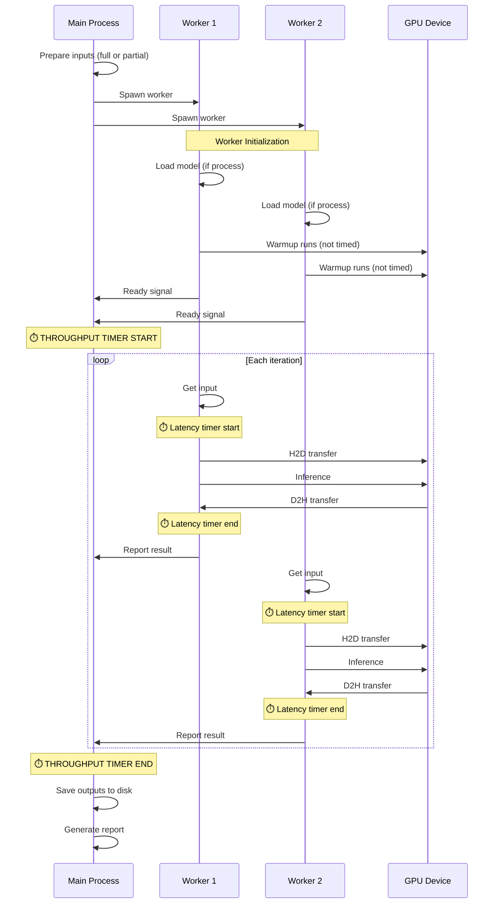

# Timing Methodology for Parallel GPU Inference Benchmarking

## Overview

This document describes the timing methodology for parallel model inference benchmarking. We measure two key metrics:
1. **Throughput**: Total iterations per second across all workers
2. **Latency**: Per-iteration time for each inference (H2D → inference → D2H)

## Parallel Benchmark Execution Flow



## Timing Brackets

### 1. Throughput Measurement (Primary Metric)

**What it measures**: Overall system performance - how many inferences can be completed per second across all workers.

**Timing bracket**:
```
START: After all workers have completed warmup and signaled ready
END:   When all workers have completed all iterations
```

**Calculation**:
```python
total_iterations = num_workers * iterations_per_worker
total_time_s = throughput_timer_end - throughput_timer_start
throughput_it_s = total_iterations / total_time_s
```

**What to INCLUDE in this measurement**:
- ✅ Worker getting task from queue and fetching input data
- ✅ H2D transfer (per iteration)
- ✅ GPU inference (per iteration)
- ✅ D2H transfer (per iteration)
- ✅ Worker reporting result back to main
- ✅ Time spent waiting for GPU resources (contention)

**What to EXCLUDE from this measurement**:
- ❌ Input preparation (data loading, preprocessing)
- ❌ Model loading and initialization
- ❌ Warmup iterations
- ❌ Output saving to disk
- ❌ Report generation

### 2. Latency Measurement (Per-Iteration Metric)

**What it measures**: Time for a single inference from input ready to output accessible on CPU.

**Timing bracket** (per worker, per iteration):
```
START: Worker has input in hand, ready to transfer to GPU
END:   Output is accessible on CPU (after D2H transfer)
```

**Calculation**:
```python
latency_ms = (latency_timer_end - latency_timer_start) * 1000
```

**What to INCLUDE in this measurement**:
- ✅ H2D transfer (host to device memory copy)
- ✅ GPU inference execution
- ✅ D2H transfer (device to host memory copy)
- ✅ GPU synchronization (ensuring inference is complete)

**What to EXCLUDE from this measurement**:
- ❌ Fetching task from queue and accessing input data
- ❌ CPU preprocessing of input
- ❌ Reporting result back to main
- ❌ Worker coordination and communication overhead

## Worker Models: Threads vs Processes

### Thread-Based Workers

**Characteristics**:
- All threads share the same model instance in memory
- Single model load during initialization
- Single warmup run before starting throughput timer
- Lower memory footprint
- Potential GPU kernel contention

**Implementation**:
```python
# Main process loads model once
model = load_model(model_path)

# Run warmup once (shared by all threads)
for _ in range(warmup_iterations):
    model.infer(warmup_input)

# Create thread workers
threads = [
    threading.Thread(target=worker_func, args=(model, worker_id))
    for worker_id in range(num_workers)
]

# Wait for threads to signal ready
barrier.wait()

# START THROUGHPUT TIMER
throughput_start = time.perf_counter()

# Start all threads
for t in threads:
    t.start()

# Wait for completion
for t in threads:
    t.join()

# END THROUGHPUT TIMER
throughput_end = time.perf_counter()
```

### Process-Based Workers

**Characteristics**:
- Each process loads its own model instance
- Independent model initialization per process
- Per-process warmup before signaling ready
- Higher memory footprint (N × model size)
- True parallel execution (no GIL)

**Implementation**:
```python
def worker_process(model_path, worker_id, ready_queue, result_queue, gate_event):
    # Each process loads model independently
    model = load_model(model_path)

    # Each process runs its own warmup
    for _ in range(warmup_iterations):
        model.infer(warmup_input)

    # Signal ready
    ready_queue.put(worker_id)

    # Wait for gate to open (all workers ready)
    gate_event.wait()

    # Run timed iterations
    for iteration in range(num_iterations):
        input_data = get_input(iteration)

        # LATENCY TIMER START
        latency_start = time.perf_counter()

        output = model.infer(input_data)  # H2D + inference + D2H

        # LATENCY TIMER END
        latency_end = time.perf_counter()

        result_queue.put(Result(worker_id, iteration, latency_end - latency_start))

# Main process
processes = [
    multiprocessing.Process(target=worker_process, args=(model_path, i, ready_q, result_q, gate))
    for i in range(num_workers)
]

for p in processes:
    p.start()

# Wait for all workers to complete warmup
for _ in range(num_workers):
    worker_id = ready_q.get(timeout=60)

# START THROUGHPUT TIMER
throughput_start = time.perf_counter()

# Open the gate (all workers start iterations)
gate.set()

# Collect results
results = []
for _ in range(num_workers * num_iterations):
    results.append(result_q.get())

# END THROUGHPUT TIMER
throughput_end = time.perf_counter()

for p in processes:
    p.join()
```

## Synchronization Requirements

### Critical Understanding

**ONNX Runtime / TensorRT behavior**:
- Inference calls are asynchronous: they launch GPU kernels and return immediately
- Output tensors may still be on GPU after the call returns
- Accessing output data triggers implicit synchronization and D2H transfer
- **You must ensure GPU work is complete before measuring latency**

### Proper Synchronization Points

1. **After inference, before stopping latency timer**:
   ```python
   # Option 1: Explicit synchronization
   session.run(...)
   cp.cuda.Stream.null.synchronize()  # Or cudaDeviceSynchronize()
   latency_timer.stop()

   # Option 2: Touch output data (implicit sync)
   output = session.run(...)
   _ = output[0][0]  # Accessing data triggers sync + D2H
   latency_timer.stop()

   # Option 3: Use CUDA events (most precise)
   end_event.record()
   end_event.synchronize()
   latency_timer.stop()
   ```

2. **When using async memcpy**:
   ```python
   cp.cuda.runtime.memcpyAsync(..., stream.ptr)
   stream.synchronize()  # MUST synchronize before using data
   ```

3. **When sharing GPU across workers**:
   - Each worker should use its own CUDA stream to avoid blocking
   - Synchronize only the worker's own stream, not the entire device
   - Be aware of GPU kernel/memory contention in timing

## Metrics to Report

### Throughput Metrics (Primary)

```
Throughput (it/s):        XXX.XX iterations per second
Total Iterations:         XXXX
Total Time (s):           XX.XXX
Workers:                  N (threads|processes)
Avg Latency (ms):         XX.XXX (mean across all iterations)
P50 Latency (ms):         XX.XXX
P95 Latency (ms):         XX.XXX
P99 Latency (ms):         XX.XXX
```

### System Metrics (Context)

```
Model:                 model_name
Precision:             fp16 | fp32 | int8
Batch Size:            N
GPU:                   NVIDIA L20
CUDA Version:          12.9.0
TensorRT Version:      10.11.0.33
```

## Common Pitfalls

### ❌ Pitfall 1: Including Warmup in Throughput Measurement

```python
# WRONG: Throughput timer starts too early
throughput_start = time.perf_counter()

for _ in range(warmup_iterations):
    model.infer(warmup_input)  # ← Not representative!

for _ in range(actual_iterations):
    model.infer(input)

throughput_end = time.perf_counter()
```

**Fix**: Start throughput timer AFTER warmup completes.

### ❌ Pitfall 2: Not Synchronizing Before Stopping Latency Timer

```python
# WRONG: Timer stops before GPU work is done
latency_start = time.perf_counter()
output = session.run(...)
latency_end = time.perf_counter()  # ← Too early!
# GPU may still be working here!
```

**Fix**: Add synchronization before stopping timer:
```python
latency_start = time.perf_counter()
output = session.run(...)
cp.cuda.Stream.null.synchronize()  # Ensure GPU work complete
latency_end = time.perf_counter()
```

### ❌ Pitfall 3: Including Output Saving in Throughput Measurement

```python
# WRONG: Throughput timer includes disk I/O
throughput_start = time.perf_counter()

for i in range(iterations):
    output = model.infer(input)
    np.save(f"output_{i}.npy", output)  # ← Disk I/O pollutes timing!

throughput_end = time.perf_counter()
```

**Fix**: Stop timer before saving outputs, or save asynchronously.

### ❌ Pitfall 4: Not Waiting for All Workers to Be Ready

```python
# WRONG: Start timing while some workers are still warming up
for p in processes:
    p.start()

throughput_start = time.perf_counter()  # ← Some workers not ready!
gate.set()
```

**Fix**: Wait for ready signals from all workers before starting timer.

### ❌ Pitfall 5: Measuring Input Fetching in Latency Timer

```python
# WRONG: Input fetching pollutes latency measurement
latency_start = time.perf_counter()
task = queue.get()  # ← Queue overhead!
input_data = task.get_data()  # ← Data access overhead!
output = model.infer(input_data)
latency_end = time.perf_counter()
```

**Fix**: Fetch task and data BEFORE starting latency timer:
```python
task = queue.get()
input_data = task.get_data()
latency_start = time.perf_counter()
output = model.infer(input_data)
cp.cuda.Stream.null.synchronize()
latency_end = time.perf_counter()
```

## Possible Implementation Patterns

The following pseudo code illustrates the recommended timing methodology for parallel inference benchmarking using a producer-consumer pattern with task queues.

**Data Access Abstraction**: Tasks encapsulate data access within the Task object via `task.get_data()`. This abstraction supports multiple storage and generation strategies:
- In-memory arrays (fast random access for multithreading)
- Shared memory segments (zero-copy access for multiprocessing)
- Memory-mapped files (disk-backed datasets larger than RAM)
- On-the-fly generation (synthetic/random data without storage)
- Remote data sources (streaming, database queries, network fetches)

---

### Producer-Consumer Pattern

**Characteristics**:
- ✅ **Simpler management**: Centralized task queue handles work distribution
- ✅ **Easier debugging**: Task ordering is explicit and deterministic
- ✅ **Flexible load balancing**: Workers naturally balance work (fast workers get more tasks)
- ⚠️ **Queue overhead**: Inter-worker communication adds latency to throughput measurement
- ⚠️ **Serial bottleneck**: Main thread must enqueue all tasks upfront

**Non-blocking Optimization**: For scenarios where queue contention becomes a bottleneck, create separate task queues for each worker thread. Each worker pulls from its dedicated queue, eliminating inter-thread blocking while maintaining the producer-consumer pattern.

#### Worker Function

```
function worker(worker_id, model_path, warmup_data_fn, task_queue, result_collector, ready_signal, gate_event):
    // ========== INITIALIZATION (NOT TIMED) ==========

    // Load model (implementation handles process vs thread semantics)
    model = load_model(model_path)

    // ========== WARMUP (NOT TIMED) ==========

    for i in range(WARMUP_ITERATIONS):
        warmup_input = warmup_data_fn()  // Callable that provides warmup data
        warmup_output = model.infer(warmup_input)

    // Signal ready to main
    ready_signal.notify(worker_id)

    // Wait for all workers to be ready
    gate_event.wait()

    // ========== TIMED LOOP ==========

    while true:
        // Get task from queue BEFORE starting latency timer
        task = task_queue.get()
        if task is sentinel:
            break

        // Fetch input BEFORE starting latency timer
        // Task encapsulates data access (array slice, shared memory, random gen, etc.)
        input_data = task.get_data()

        // ⏱️ LATENCY TIMER START
        latency_start = high_resolution_timer()

        // H2D + Inference + D2H (atomic operation)
        output = model.infer(input_data)

        // Ensure GPU work is complete
        gpu_synchronize()

        // ⏱️ LATENCY TIMER END
        latency_end = high_resolution_timer()
        latency_ms = (latency_end - latency_start) * 1000

        // Report result (after stopping timer)
        result_collector.add(Result{
            task_id: task.task_id,
            worker: worker_id,
            latency_ms: latency_ms
        })
```

#### Main Orchestration

```
function main():
    // ========== PREPARATION (NOT TIMED) ==========

    // Prepare data source (implementation decides: in-memory, mmap, synthetic, etc.)
    // For example:
    //   - Multithreading: Load full dataset into memory, tasks reference array indices
    //   - Multiprocessing: Create shared memory, tasks hold references to shared segments
    //   - Synthetic: Tasks generate random data on-the-fly via callable
    data_source = prepare_data_source(input_path, worker_mode)

    // Create warmup data provider (callable that returns warmup samples)
    warmup_data_fn = data_source.create_warmup_fn()

    // Create task queue and populate with task objects
    // Each Task encapsulates its data access strategy via get_data()
    task_queue = create_queue()
    total_iterations = num_workers * iterations_per_worker
    for task_id in range(total_iterations):
        task = data_source.create_task(task_id)  // Task knows how to get its data
        task_queue.put(task)

    // Add sentinel values for worker termination
    for _ in range(num_workers):
        task_queue.put(sentinel)

    // Create synchronization primitives
    ready_signal = create_ready_signal()
    gate_event = create_event()
    result_collector = create_result_collector()

    // ========== SPAWN WORKERS (NOT TIMED) ==========

    workers = []
    for worker_id in range(num_workers):
        worker = create_worker(
            target: worker,
            args: (worker_id, model_path, warmup_data_fn, task_queue,
                   result_collector, ready_signal, gate_event),
            mode: worker_mode  // PROCESS or THREAD
        )
        worker.start()
        workers.append(worker)

    // ========== WAIT FOR WARMUP (NOT TIMED) ==========

    for _ in range(num_workers):
        worker_id = ready_signal.wait(timeout=60_seconds)
        print("Worker {worker_id} ready")

    print("All workers ready. Starting throughput measurement...")

    // ========== THROUGHPUT MEASUREMENT ==========

    // ⏱️ THROUGHPUT TIMER START
    throughput_start = high_resolution_timer()

    // Open the gate - all workers start pulling tasks
    gate_event.set()

    // Wait for all workers to complete
    for worker in workers:
        worker.join()

    // ⏱️ THROUGHPUT TIMER END
    throughput_end = high_resolution_timer()

    // ========== METRICS CALCULATION (NOT TIMED) ==========

    total_iterations = num_workers * iterations_per_worker
    total_time_s = throughput_end - throughput_start
    throughput_it_s = total_iterations / total_time_s

    results = result_collector.get_all()
    latencies_ms = [r.latency_ms for r in results]

    print("Throughput: {throughput_it_s:.2f} it/s")
    print("Total Time: {total_time_s:.6f} s")
    print("Total Iterations: {total_iterations}")
    print("Avg Latency: {mean(latencies_ms):.3f} ms")
    print("P50 Latency: {percentile(latencies_ms, 50):.3f} ms")
    print("P95 Latency: {percentile(latencies_ms, 95):.3f} ms")
    print("P99 Latency: {percentile(latencies_ms, 99):.3f} ms")

    // ========== OUTPUT SAVING (NOT TIMED) ==========

    if output_path is not None:
        save_outputs(output_path, results)
```

---

### Key Design Principles

1. **Work Distribution**:
   - Centralized task queue handles work distribution
   - For non-blocking scenarios, create per-worker queues to eliminate contention
   - Workers naturally balance work (faster workers get more tasks from shared queue)

2. **Data Access Abstraction**:
   - Task encapsulates data access via `task.get_data()`. The task object handles:
     * Array slicing (multithreading with in-memory numpy arrays)
     * Shared memory references (multiprocessing with zero-copy semantics)
     * On-the-fly generation (synthetic/random data via callables)
     * Memory-mapped files, HDF5, streaming sources

3. **Language Agnostic**: Pattern works for Python, C++, or any language with:
   - High-resolution timers (`time.perf_counter()`, `std::chrono::high_resolution_clock`)
   - GPU synchronization (`cupy.cuda.Stream.synchronize()`, `cudaDeviceSynchronize()`)
   - Multi-threading/processing primitives (barriers, events, queues)

4. **Thread vs Process Flexibility**:
   - **Threads**: Share model instance, single warmup, lower memory
   - **Processes**: Independent models, per-process warmup, higher memory

5. **Result Collection Options**:
   - **Threads**: Append to shared list (with lock)
   - **Processes**: Use multiprocessing Queue, or write to shared memory

6. **Timing Hygiene**:
   - Fetch input **before** starting latency timer (data access not timed)
   - Synchronize GPU **before** stopping latency timer
   - Start throughput timer **after** all workers are ready
   - Stop throughput timer **after** all workers finish

## Summary

### Timing Philosophy

**Throughput measurement answers**: "How fast can my system process inferences in production?"
- Includes all realistic overheads (contention, scheduling, communication)
- Excludes one-time costs (loading, warmup) and post-processing (saving, reporting)

**Latency measurement answers**: "How long does a single inference take?"
- Measures H2D + inference + D2H as an atomic unit
- Provides distribution (P50, P95, P99) to understand variance

### Key Principles

1. **Warmup before timing**: Always run warmup iterations to prime caches, allocate memory, and compile kernels
2. **Synchronize GPU work**: Ensure GPU operations complete before stopping timers
3. **Separate concerns**: Don't mix initialization, computation, and I/O in timing brackets
4. **Use appropriate tools**: CUDA events for GPU-accurate timing, CPU timers for end-to-end wall time
5. **Report distributions**: Mean latency alone is insufficient; report P50, P95, P99

### Quick Reference

| Metric | Start | End | Includes |
|--------|-------|-----|----------|
| **Throughput** | All workers ready (post-warmup) | All iterations complete | Queue get, task data access, H2D, inference, D2H, result reporting, GPU contention |
| **Latency** | Input data ready in worker | Output accessible on CPU | H2D + inference + D2H (atomic operation), GPU sync |

---

**Critical for accurate benchmarking**: Measure what matters in production. Include realistic overheads, exclude one-time costs, and always synchronize GPU work before measuring time.
