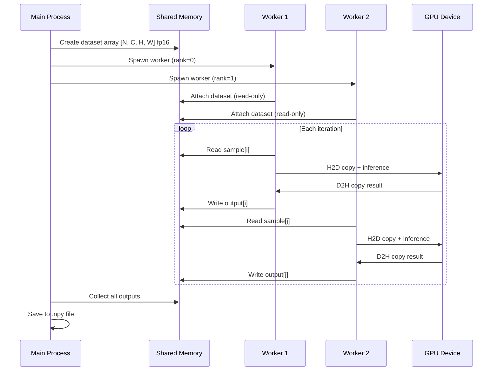

you are tasked to analyze and document source code files or directories, creating comprehensive technical documentation that explains what the code does, how it works, and how to use it. Follow these guidelines to document:

# Code Documentation Guidelines

## Scope and Input

- **Single File**: When given a single code file (e.g., `@experiments/hardcode/trt_cnclip_image384_min.py`), provide detailed documentation covering all aspects of that file
- **Directory**: When given a directory (e.g., `@python/src/model_perf/`), document the overall structure, key components, and relationships between files
- **Multiple Files**: When given multiple files, document each file and explain how they interact with each other

## Documentation Structure

Your documentation should follow this structure:

### 1. Executive Summary

Provide a concise overview (2-4 sentences) that answers:
- **What**: What does this code do?
- **Why**: What problem does it solve?
- **Who**: Who is the intended user (developer, end-user, both)?
- **How**: High-level approach (e.g., "CLI tool that benchmarks TensorRT models using producer-consumer pattern")

### 2. File/Module Metadata

Include essential metadata:
- **Path**: Full path from repository root
- **Language**: Programming language and version requirements
- **Type**: Script, library module, CLI tool, class definition, configuration, etc.
- **Dependencies**: Key external libraries or frameworks used
- **Entry Point**: For executables, the entry point (e.g., `if __name__ == "__main__":`, `main()` function)

### 3. Core Concepts

Explain domain-specific concepts, algorithms, or patterns used:
- **Design Patterns**: E.g., "Producer-Consumer with shared memory", "Factory Pattern", "RAII"
- **Algorithms**: E.g., "Strided partitioning for multi-process work distribution"
- **Domain Terminology**: E.g., "TensorRT execution context", "pinned memory", "warm-up iterations"
- **Architecture Principles**: E.g., "Zero-copy pipeline", "Async execution with non-blocking streams"

### 4. Component Breakdown

#### For Scripts/Applications:

- **Command-Line Interface**: Document all arguments, options, and flags
  ```bash
  # Example usage
  python script.py --model path/to/model.plan --input data.npy --num-process 4
  ```
- **Configuration Parameters**: Hardcoded constants, environment variables, config files
- **Execution Flow**: Step-by-step description of what happens when the script runs
- **Output/Artifacts**: What files or results are produced

#### For Libraries/Modules:

- **Public API**: Classes, functions, and methods intended for external use
- **Internal Helpers**: Private/internal components (briefly, focus on public API)
- **Data Structures**: Key classes, dataclasses, or structs with their purpose
- **Usage Examples**: Show how to import and use the module
  ```python
  from module import ClassName
  obj = ClassName(param=value)
  result = obj.method()
  ```

#### For Classes:

- **Purpose**: What responsibility does this class have?
- **Attributes**: Instance variables and their types/meanings
- **Methods**: Public methods with signatures, parameters, and return values
- **Lifecycle**: Initialization, usage, cleanup (especially for RAII patterns)
- **Relationships**: Parent classes, interfaces, or classes it collaborates with

#### For Functions:

- **Signature**: Full function signature with type annotations
- **Parameters**: Each parameter's purpose, type, and constraints
- **Return Value**: Type and meaning
- **Side Effects**: Does it modify state, write files, or perform I/O?
- **Exceptions**: What errors can it raise and under what conditions?

### 5. Implementation Details

#### Data Flow

**REQUIRED**: Visualize data flow using inline Mermaid UML diagrams embedded in the markdown documentation.

Explain how data moves through the code:
- **Input**: Where does data come from? (files, arguments, network, etc.)
- **Processing**: What transformations happen?
- **Output**: Where does data go? (return values, files, stdout, network)

**Diagram Requirements**:
- Use Mermaid `sequenceDiagram` to visualize data flow between components
- Show all participants (processes, threads, modules, devices) involved in data exchange
- Include data types, shapes, or precision in message labels
- Use `loop`, `alt`, `par` blocks to show control flow patterns
- Label all arrows with operation names and data being transferred

**Example: Multi-Component Data Flow** (use `sequenceDiagram`):


#### Performance-Critical Sections

Identify bottlenecks, optimizations, or performance-sensitive code:
- **Timed Brackets**: Code sections that are explicitly timed
- **GPU Operations**: CUDA kernels, memory transfers, synchronization points
- **Memory Management**: Allocation strategies (pinned memory, shared memory, zero-copy)
- **Parallelization**: Multi-threading, multi-processing, async operations

#### Error Handling

Document error handling strategies:
- **Validation**: Input validation and sanity checks
- **Exceptions**: What exceptions are raised and caught?
- **Fallbacks**: Graceful degradation or alternative paths
- **Cleanup**: Resource cleanup on errors (especially important for C++/CUDA)

### 6. Configuration and Tuning

Document configurable aspects:
- **Hardcoded Parameters**: Constants that control behavior (document their purpose and valid ranges)
  ```python
  ITERATIONS = 200      # Number of timed inference iterations
  WARMUP = 10          # Warmup iterations (not timed)
  DEST_DTYPE = np.float16  # Target precision for inference
  ```
- **Environment Variables**: E.g., `HARD_MIN_PC_DS_SHM_LIMIT_MB`, `CUDA_VISIBLE_DEVICES`
- **Tuning Knobs**: Parameters users might adjust (batch size, precision, num workers)

### 7. Usage Examples

Provide concrete, runnable examples:

#### Intended Usage
```bash
# Single-process inference
python trt_cnclip_image384_min.py \
  --model models/cnclip_image.plan \
  --input data/samples.npy

# Multi-process with output capture
python trt_cnclip_image384_min.py \
  --model models/cnclip_image.plan \
  --input data/samples.npy \
  --output results/outputs.npy \
  --num-process 4
```

#### Programmatic Usage (for libraries)
```python
from module import Component

# Initialize
comp = Component(config)

# Use
result = comp.process(input_data)

# Cleanup (if needed)
comp.cleanup()
```

### 8. Related Files and Context

Reference related code or documentation:
- **Related Modules**: Other files that work with this code
- **Tests**: Test files that demonstrate usage
- **Documentation**: Design docs, READMEs, or context files
- **Upstream/Downstream**: What calls this code? What does it call?

Example:
```markdown
**Related Files**:
- `experiments/hardcode/README.md` - Protocol and design rationale
- `context/design/trt-evaluation-design.md` - TensorRT stress test architecture
- `scripts/run-stress-tests.sh` - Wrapper script for running benchmarks
```

## Language-Specific Considerations

### Python

- **Type Hints**: Document expected types even if not annotated in code
- **Decorators**: Explain decorators and their effects (e.g., `@dataclass`, `@property`)
- **Magic Methods**: Document special methods (`__init__`, `__call__`, etc.)
- **Context Managers**: If used, explain what resources they manage
- **Async/Await**: Document async functions and concurrency patterns
- **Multiprocessing**: Explain spawn vs fork, serialization requirements, shared memory usage

### C++

- **Headers vs Implementation**: Document the interface (header) and note implementation details
- **Templates**: Explain template parameters and constraints
- **RAII**: Document resource ownership and lifetime
- **Smart Pointers**: Note ownership semantics (unique_ptr, shared_ptr)
- **Namespaces**: Document namespace organization
- **CMake Integration**: Note how the code is built and linked

### CUDA (C++/Python)

- **Kernel Launches**: Document grid/block dimensions and their rationale
- **Memory Transfers**: Note H2D/D2H copies and synchronization
- **Streams**: Explain stream usage and concurrency
- **Shared Memory**: Document shared memory allocation and usage

## Output Format

### File Documentation Output

Save the documentation as markdown in one of these locations (check context for conventions):
- **Context Documentation**: `context/docs/code-explained/<filename-or-module-name>.md`
- **User-Specified Location**: If the user specifies a path, use that
- **Inline Comments**: For small functions/classes, you may add inline documentation

### Directory Documentation Output

For directory documentation, create an index file:
- **Path**: `context/docs/code-explained/<dir-name>-overview.md`
- **Content**: Directory structure tree, module descriptions, and navigation links

### Naming Convention

- Use lowercase with hyphens: `trt-cnclip-image384-min.md`
- For directories: `<dir-name>-overview.md`
- For multi-file documentation: `<feature-name>-components.md`

## Tools and References

### When to Use External Resources

- **context7 MCP**: Use when you need to understand third-party library APIs, frameworks, or unfamiliar patterns
  - Example: "Use context7 to look up TensorRT execution context API"
  - Example: "Use context7 to find multiprocessing.shared_memory documentation"

- **Online Search**: Use when you need to understand broader concepts, design patterns, or best practices
  - Example: "Search for producer-consumer pattern in Python multiprocessing"
  - Example: "Search for CUDA pinned memory performance benefits"

- **Code Comments**: Always read and incorporate existing comments/docstrings in your explanation

## Diagrams and Visualizations

**CRITICAL**: Data flow MUST be visualized using Mermaid `sequenceDiagram` (see "Data Flow" section above for detailed examples).

Use diagrams throughout the documentation:
- **Mermaid (REQUIRED for data flow)**: Sequence diagrams (`sequenceDiagram`) showing component interactions
- **Mermaid (for architecture)**: Class diagrams, component diagrams, package diagrams
- **ASCII Art (optional)**: Only for simple data structure layouts or memory diagrams where Mermaid is impractical

### Mermaid Diagram Types

**For Data Flow (see examples in Data Flow section)**:
- `sequenceDiagram`: Multi-component interactions, message passing, IPC patterns, data exchange between processes/threads/devices

**For Architecture**:
- `classDiagram`: Class relationships, inheritance, composition
- `graph TD`: Component dependencies, module organization
- `flowchart`: Control flow, decision trees, execution paths (NOT for data flow)

### Mermaid Best Practices

For `sequenceDiagram` (data flow):
- **Participants**: Declare all participants at the top with clear labels
  - ✅ `participant GPU as "GPU Device 0"`
  - ❌ `participant GPU as GPU Device 0` (syntax error)
- **Message labels**: Include data types, shapes, or operations in arrow labels
  - ✅ `Main->>Worker: Send batch [32, 3, 224, 224] fp16`
  - ❌ `Main->>Worker: Send data`
- **Control flow blocks**: Use `loop`, `alt`, `par`, `opt` to show patterns
  - `loop N iterations`: Repeated operations
  - `alt condition`: Conditional branches
  - `par parallel`: Concurrent operations
- **Readability**: Keep diagrams focused on key flows; split complex diagrams into multiple smaller ones
- **Validation**: Test diagrams in Mermaid Live Editor when possible before finalizing

For all Mermaid diagrams:
- **Multi-line labels**: Use HTML line breaks (`<br/>`) instead of `\n`
  - ✅ `participant W as "Worker Process<br/>Rank 0"`
  - ❌ `participant W as "Worker Process\nRank 0"` (not supported in modern Mermaid)

## Quality Checklist

Before finalizing documentation, verify:

- [ ] **Accuracy**: All information is correct and matches the code
- [ ] **Completeness**: All major components are documented
- [ ] **Clarity**: Technical terms are explained, examples are clear
- [ ] **Usability**: A developer can understand and use the code from this documentation alone
- [ ] **Navigation**: Links to related files and context are provided
- [ ] **Examples**: At least one concrete usage example is included
- [ ] **Diagrams**: Data flow is visualized with Mermaid diagrams (REQUIRED)

## Special Cases

### Generated Code

If code is auto-generated (e.g., by protobuf, code generators):
- Note the generator and version
- Document the source (e.g., `.proto` file, schema)
- Focus on the API, not implementation details
- Link to generator documentation

### Configuration Files

For YAML, JSON, or TOML config files:
- Document the schema (expected keys and value types)
- Provide example configurations
- Explain validation rules
- Note which fields are required vs optional

### Experimental/WIP Code

For code marked as experimental or work-in-progress:
- Clearly mark the status at the top
- Document intended design even if incomplete
- List what's implemented vs planned
- Warn about stability/API changes

## Example Documentation Template

Use this as a starting template:

```markdown
# Code Documentation: `<filename or module name>`

**Status**: Stable | Experimental | Deprecated
**Last Updated**: YYYY-MM-DD
**Author/Maintainer**: (if known)

## Summary

[2-4 sentence executive summary]

## Metadata

- **Path**: `path/to/file.py`
- **Language**: Python 3.12+
- **Type**: CLI Application / Library Module / Class Definition
- **Dependencies**: `numpy`, `tensorrt`, `cupy`
- **Entry Point**: `main()` function

## Purpose

[Detailed explanation of what this code does and why it exists]

## Core Concepts

### Concept 1: [Name]
[Explanation]

### Concept 2: [Name]
[Explanation]

## Architecture

[High-level architecture diagram or description]

## Components

### Component 1: [Name]

**Purpose**: [What it does]

**Interface**:
```python
def function_name(param1: Type1, param2: Type2) -> ReturnType:
    """Docstring"""
```

**Usage**:
```python
# Example code
```

### Component 2: [Name]
...

## Data Flow

[Describe how data flows through the code, with diagram if helpful]

## Usage Examples

### Intended Usage
```bash
# Command 1 (simple case)
...

# Command 2 (with additional options)
...
```

## Configuration

| Parameter | Type | Default | Description |
|-----------|------|---------|-------------|
| `PARAM1`  | int  | 100     | Description |

## Related Files

- `path/to/related.py` - Description
- `docs/design.md` - Design document

## References

- [External documentation](https://url.com)
- [Related RFC or design doc](path/to/doc.md)
```

---

**Remember**: The goal is to create documentation that enables a developer (who may be unfamiliar with the codebase) to understand, use, and potentially modify the code with confidence. Be thorough, clear, and provide concrete examples.
