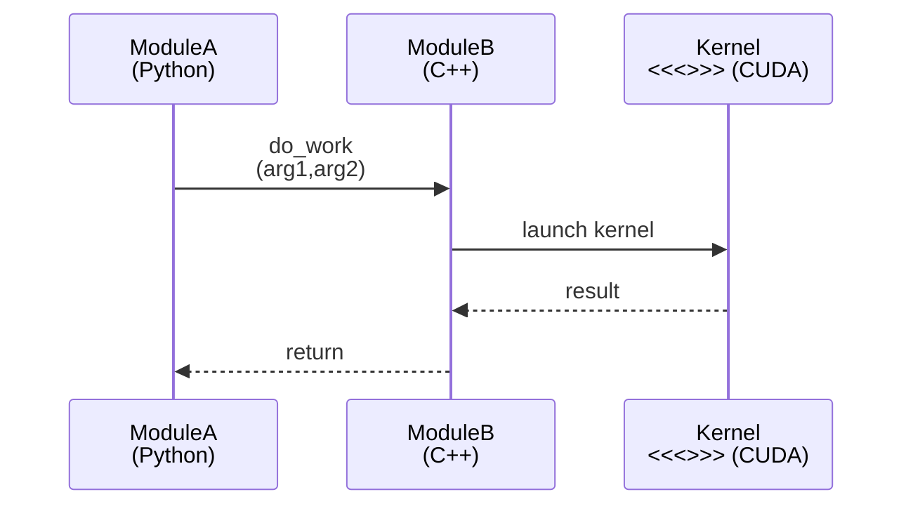

you are tasked to create Mermaid `sequenceDiagram` figures that are easy to read in markdown notes. follow these guidelines.

# Mermaid Sequence Diagram Styling Guide

Goal: keep participant blocks and message labels short enough that the diagram has a roughly even aspect ratio (not overly wide), **without breaking important function/class names**.

## 1. General rules

- Prefer clarity over completeness: if the flow is complex, split into multiple diagrams.
- Keep statements one per line; `sequenceDiagram` keyword must be lowercase.
- Use HTML line breaks (` `) for multi‑line labels; raw `\n` is not supported.

## 2. Participants

- Declare all participants at the top with short IDs and readable labels.
- If a label is long, **wrap the label**, not the ID:
  - ✅ `participant CK as call_spqr_mul / call_spqr_mul_fused`
  - ❌ `participant call_spqr_mul_fused as ...` (ID too long)
- Do **not** split a function/class name across lines. If it is long, wrap around separators:
  - ✅ `participant QL as QuantizedLinear forward`
  - ✅ `participant TO as torch.ops spqr_cuda`
  - ❌ `participant F as spqr_quan tized_matvec` (breaks name)
- If you need to add context (language, file), put it on a new line:
  - `participant CXX as spqr_mul_fused (C++)`

## 3. Message labels (arrows)

- Keep arrow text concise (ideally < 40 chars).
- When showing a function call, keep the **function name intact** and wrap arguments:
  - ✅ `QL->>CK: call_spqr_mul_fused (m,n,bits, beta1,beta2,...)`
  - ❌ `QL->>CK: call_spqr_mul_ fused(m,n,...)`
- For repeated long prefixes, shorten with an ID or alias:
  - Use `TO: torch.ops spqr_cuda` once, then `TO->>CXX: spqr_mul_fused(...)`.
- Multi‑line arrow labels are fine, but avoid more than 3 lines.

## 4. Control‑flow blocks

- Use `alt/else/end`, `loop`, `opt`, `par` to show branching or repetition.
- Keep block titles short; if needed, wrap them:
  - ✅ `alt act‑order enabled`
  - ✅ `alt long condition wrapped`
- Avoid deep nesting; if you need >2 nested blocks, split the diagram.

## 5. Layout / aspect ratio tips

- If the diagram looks too wide:
  - Wrap participant labels with ` `.
  - Wrap long arrow labels (arguments, shapes, etc.).
  - Reduce duplicate text by using short IDs.
- If the diagram looks too tall:
  - Merge trivial steps into one arrow.
  - Remove return arrows unless they add meaning.

## 6. Example template

## 7. Quick checklist

- [ ] No participant or message label breaks a function/class name.
- [ ] Long labels are wrapped with ` `.
- [ ] Diagram fits comfortably without horizontal scrolling.
- [ ] Only essential steps are shown; complex flows split.
- [ ] Diagram validated in Mermaid Live Editor when possible.

