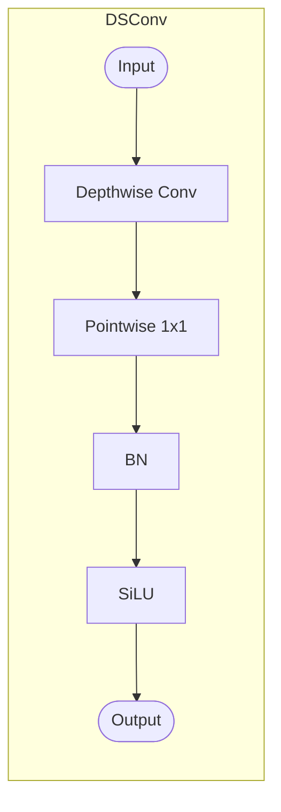

you are tasked to read a paper and create a structured note summarizing its key aspects. Use the following template to ensure all important elements are captured. If user does not specify an output dir, save the note in dir `notes/<paper-name>/`, name the output markdown as `main-note.md`, and store any images in a subdir `figures/`. Ensure all image paths in the markdown are relative to the markdown file location.

---

## REFERENCE CODE PATH CONFIGURATION

**IMPORTANT: Source code references are OPTIONAL and may not exist.**

- **Default assumption**: Do NOT assume reference code exists unless the user explicitly tells you
- **When user provides code**: Only then include code citations in your notes

**If reference code is available:**

- **Default location**: Reference code is typically stored in `context/refcode/{project-name}/...`
  - Example: `context/refcode/yolov13/ultralytics/nn/modules/block.py:1914`

- **Custom location**: If the user specifies a different reference code location, use that path instead
  - Example: User says "reference code is in `src/implementation/`"
  - Then use: `src/implementation/model/transformer.py:45`

- **Usage in citations**: Replace `{REFCODE_PATH}` placeholder with the actual path
  - In examples below, `{REFCODE_PATH}` represents the base path to reference code
  - Adjust based on project structure

**If no reference code is available:**
- Focus on citing the paper itself (LaTeX source, PDF, sections)
- Use algorithmic descriptions from the paper
- Create pseudocode based on mathematical formulations in the paper

---

## FORMATTING GUIDE

### Section Structure
- Use numbered sections (0-19) as shown in the template
- Create nested subsections (e.g., 2.1, 2.2, 3.1, 3.2) when detailed breakdowns are needed
- Add descriptive subsection titles that clarify the content (e.g., "2.1 Why previous YOLOs are not enough")

### Bulleted Lists
- Always format as: `- **Item**: description`
- Use bold for the key term or concept, followed by colon and explanation
- Example: `- **Local aggregation (CNNs)**: Convolutions aggregate locally and are bounded by receptive field.`

### Citations & Blockquotes
- **CRITICAL**: Ground your notes with blockquote snippets from the paper
- Format: `> "Direct quote from paper" (Section name; paper-source/path/to/file.tex)`
- Place citations immediately after making a claim to support it
- Use blockquotes liberally to provide evidence for key points
- Example:
  ```markdown
  - **Problem**: Prior YOLOs capture local or pairwise relations; miss global many-to-many correlations.
    > "[B]oth the convolutional architectures... are limited to local information aggregation..." (Abstract; paper-source/yolo13/sections/1_abstract.tex)
  ```

### Code & Pseudocode
- Include implementation details with Python-like pseudocode when explaining algorithms
- Show data shapes in comments: `# X: (B, N, C)`
- Use code fencing with language tags: ` ```python ` or ` ```text `
- **Code citations (ONLY if user provides reference code)**:
  - **Default**: Code is typically in `context/refcode/{project-name}/...`
  - **Custom**: Use the path specified by the user
  - Cite with file path and line number: `({REFCODE_PATH}/path/to/file.py:line_number)`
- **Without reference code**: Base pseudocode on paper's algorithmic descriptions
- Example:
  ```python
  # Inputs: [x0, x1, x2] ~ [P3, P4, P5]
  x1_ds = AvgPool2d(2)(x0)    # -> (B,C,H,W)
  x_fused = Conv1x1(x_cat)    # -> (B,C,H,W)
  ```
  Optional code reference (only if available):
  > Implementation: (context/refcode/yolov13/ultralytics/nn/modules/block.py:1788)

### Diagrams
- Use Mermaid diagrams extensively for architecture, data flow, and component interactions
- Include flowcharts for pipelines: ` ```mermaid flowchart LR ... ``` `
- Label nodes clearly and use subgraphs for complex modules
- Example structure:
  ```mermaid
  flowchart LR
    subgraph ModuleName["Module Name"]
      direction LR
      X([Input]) --> OP1["Operation 1"] --> OP2["Operation 2"]
      OP2 --> Y([Output])
    end
  ```

### Figures & Images
- Embed images with descriptive alt text: ``
- Follow with a blockquote caption from the paper:
  > "The network architecture of our proposed model..." (paper-source/...)
- Explain what's shown in the figure after the image

### Detailed Technical Subsections
- Create "How X works" subsections to dive deep into mechanisms
- Include both high-level explanations and code-level details
- Use nested structure: concept → diagram → pseudocode → implementation notes
- Example: "3.1 FullPAD", "3.2 HyperACE", "Feature Fusion (H3, H4, H5)"

### Notation & Symbols
- Define mathematical notation inline or in dedicated glossary
- Use proper formatting: `R^{N×C}` for matrices, `∈` for membership
- Explain dimensions: "(B, N, C) where B=batch, N=nodes, C=channels"

---

## CITATION GUIDE (CRITICAL)

To ground your note in the actual paper content:

1. **After every key claim or concept**, add a supporting blockquote from the paper
2. **Format**: Use `>` blockquote syntax with source reference in parentheses
3. **Source paths**: Include the actual file path from the paper source if available

### Paper Citations (ALWAYS REQUIRED)
Cite from the paper's LaTeX/markdown source, PDF, or sections:
```markdown
- **Problem**: Convolutions are limited by receptive field.
  > "Convolutional operations inherently perform local information aggregation within a fixed receptive field." (Introduction; paper-source/sections/2_introduction.tex)
```

### Code Citations (OPTIONAL - only if user provides reference code)

**Do NOT assume code exists.** Only include code citations if the user explicitly provides reference code.

**If reference code is available:**
- **Default location**: `context/refcode/{project-name}/...`
- **Custom location**: Use path specified by user
- **Format**: `({REFCODE_PATH}/path/to/file.py:line_number)` where `{REFCODE_PATH}` is the actual path
- **Example with default**:
  > "def forward(self, x): out = x[0] + self.gate * x[1]" (context/refcode/yolov13/ultralytics/nn/modules/block.py:1914)
- **Example with custom path**:
  > "class Encoder: ..." (src/model/transformer.py:45)

**If no reference code is available:**
- Focus on paper citations only
- Create pseudocode based on algorithmic descriptions in the paper
- Reference equations, algorithms, and figures from the paper itself

### Citation Frequency
- Aim for multiple citations per major section (2-4 minimum)
- Paper citations are mandatory; code citations are optional

---

below is the template

# [Paper Title]

## 0. Metadata
- **Full Title**: 
- **Authors**: 
- **Venue / Year**: 
- **Links**: PDF | Project Page | Code | Dataset | ArXiv/DOI
- **Keywords**: 
- **Paper ID (short handle)**: 

## 1. TL;DR (3–5 bullets)
Use bold key terms followed by explanations:
- **Problem**: [One-line problem statement]
- **Idea**: [Core insight or approach]
- **System**: [Main architectural or methodological contribution]
- **Efficiency**: [Performance or efficiency gains, if applicable]
- **Result**: [Headline results with numbers]

Example:
- **Problem**: Prior YOLOs capture local or pairwise relations; miss global many-to-many correlations.
- **Result**: SOTA mAP on MS COCO with fewer FLOPs; e.g., +3.0 mAP over YOLO11-N.

## 2. Problem & Motivation

**Use nested subsections (2.1, 2.2, etc.) to organize complex problems:**

### 2.1 [Descriptive title for limitation/gap]
- What problem is being solved? Why now? Prior limitations/gaps
- Support with blockquote citations from the paper

### 2.2 [How this paper addresses it]
- How the proposed approach tackles each limitation
- Include blockquotes explaining the solution

**Example structure:**
### 2.1 Why previous YOLOs are not enough
- **Local aggregation (CNNs)**: Convolutions aggregate locally and are bounded by receptive field.
  > "Convolutional operations inherently perform local information aggregation..." (Introduction; paper-source/...)

### 2.2 How YOLOv13 addresses these issues
- **HyperACE**: Learns soft hyperedges and performs linear-complexity message passing...
  > "[W]e propose a novel Hypergraph-based Adaptive Correlation Enhancement..." (Introduction; paper-source/...)

## 3. Key Ideas & Contributions (Condensed)
- 
- 
- 

## 4. Method Overview

**Provide a high-level summary, then break into detailed subsections (4.1, 4.2, etc.):**

One-paragraph summary of the approach and how components interact. High-level data flow or pipeline description.

### 4.1 [Component/Module A]
- **Goal**: What this component achieves
- **Mechanism**: How it works (high-level)
- Include a figure or diagram if available:
  
  > "Caption from paper..." (paper-source/...)
- **Pseudocode** (if applicable):
  ```python
  # High-level flow
  input -> operation -> output
  ```

### 4.2 [Component/Module B]
- Similar structure for each major component

**Example:**
### 3.1 FullPAD
- **Goal**: Achieve fine-grained information flow and representation synergy across the pipeline.
- **Mechanism**: Aggregate multi-level backbone features via HyperACE; redistribute enhanced features to backbone, neck, and head.


> "The network architecture of our proposed YOLOv13 model..." (paper-source/...)

- **Pseudocode**:
  ```python
  # Inputs: backbone features B3, B4, B5
  F = HyperACE([B3, B4, B5])
  H3, H4, H5 = Upsample(F), F, Downsample(F)
  B3_out = B3 + gate3 * H3
  ```

## 5. Interface / Contract (Inputs & Outputs)
- Inputs (types, shapes, modalities, constraints):
- Outputs (types, interpretations, constraints):
- Control/conditioning signals (if any):
- Required pre/post-processing steps:

## 6. Architecture / Components

**Describe each component with diagrams, code snippets, and pseudocode:**

- Components and their responsibilities:
  - **[Component A]**: Brief description
  - **[Component B]**: Brief description

**For each major component, provide:**

### [Component Name]
- **Description**: What it does and why it's important
  > "Quote from paper describing component" (Method; paper-source/...)
- **Source reference** (optional, only if reference code exists): `{REFCODE_PATH}/path/to/file.py:line_number`
- **Mermaid diagram**:
  ```mermaid
  flowchart LR
    subgraph ComponentName["Component Name"]
      direction LR
      X([Input]) --> OP["Operation"] --> Y([Output])
    end
  ```
- **Pseudocode** (with shape annotations, based on paper or code):
  ```python
  # Inputs: x (B,C,H,W)
  output = Operation(input)  # -> (B,C',H',W')
  ```

**Example:**

### DSConv
- **Description**: Depthwise-separable convolution (depthwise → pointwise), then BN + SiLU; lightweight primitive.
  > "The DSConv block first applies a standard depthwise separable convolutional layer..." (paper-source/...)
- **Source** (optional): context/refcode/yolov13/ultralytics/nn/modules/conv.py:84



## 7. Algorithm / Pseudocode (Optional)

**Provide detailed pseudocode for key algorithms with:**
- Shape annotations in comments: `# X: (B, N, C)`
- Inline comments explaining each step
- Base on paper's algorithmic descriptions, mathematical formulations, or reference code (if available)

```python
# Inputs: X: (B, N, C), M hyperedges, h = num_heads
# 1) Context-conditioned prototypes
ctx = cat([X.mean(dim=1), X.max(dim=1).values], dim=-1)
proto_offs = context_net(ctx).view(B, M, C)
prototypes = prototype_base + proto_offs  # (B, M, C)

# 2) Multi-head similarity
Xh = pre_head_proj(X).view(B, N, h, d)
Ph = prototypes.view(B, M, h, d)
logits = bmm(Xh, Ph.transpose(-2, -1)) / sqrt(d)
A = softmax(logits, dim=1)  # (B, N, M) - per-hyperedge normalization

# 3) Hypergraph convolution (V→E→V)
He = bmm(A.transpose(1, 2), X)      # (B, M, C)
He = EdgeProj(He)                   # Linear+GELU
X_new = bmm(A, He)                  # (B, N, C)
Y = X + NodeProj(X_new)             # residual
```

**Optional: Reference implementation (only if reference code exists):**
> "He = A^T X ... return X_new + X" ({REFCODE_PATH}/path/to/file.py:line_range)

Example: (context/refcode/yolov13/ultralytics/nn/modules/block.py:1625-1650)

## 8. Training Setup
- Data: sources, size, splits, preprocessing:
- Objective(s) / loss functions:
- Model sizes / parameters:
- Hyperparameters & schedules:
- Compute budget (GPUs, hours):
- Training tricks & stabilization notes:

## 9. Inference / Runtime Behavior
- Inputs required at inference and their formats:
- Control knobs (temperature, steps, search, actions):
- Latency / throughput notes:
- Failure modes observed at inference:

## 10. Experiments & Results

**Structure results clearly with references to tables/figures:**

- **Benchmarks & datasets**: List evaluation datasets and tasks
- **Metrics**: Primary and secondary metrics used
- **Baselines**: What models are compared against
- **Headline results** (with table/figure pointers):
  - [Model X]: [metric] = [value] ([improvement] over [baseline])
  - Reference: Table N, Figure M
  - Example: "YOLOv13-N achieves 42.3 mAP (+3.0 over YOLO11-N) at 8.2 GFLOPs (Table 1)"

**Include relevant tables/figures:**

> "Comparison of YOLOv13 with state-of-the-art detectors on MS COCO..." (paper-source/...)

**Key takeaways:**
- Most important findings in bullet form
- Support with blockquote citations from the results section

## 11. Ablations & Analysis
- What design choices matter most:
- Scaling trends:
- Sensitivity analyses:

## 12. Limitations, Risks, Ethics
- Stated limitations:
- Observed failure cases:
- Safety, bias, and ethical considerations:

## 13. Applicability & Integration Notes (Project-Focused)
- Where this could fit in our stack:
- Minimal viable integration / prototype plan:
- Dependencies or blockers:

## 14. Reproducibility Plan
- Checklist: data availability, code, configs, seeds:
- Reproduction steps at high level:
- Known gaps vs paper setup:

## 15. Related Work
- Closest prior work and how this differs:
- Historical context:

## 16. Open Questions & Follow-Ups
- 
- 

## 17. Glossary / Notation
- Symbols and their meanings:
- Important terms defined:

## 18. Figures & Diagrams (Optional)
- [Placeholder] Overview figure path:
- [Placeholder] Architecture diagram path:
- [Placeholder] Activity/flow diagram path:

## 19. BibTeX / Citation
```bibtex
@article{<key>,
  title={...},
  author={...},
  journal={...},
  year={...}
}
```

---

## ADDITIONAL TIPS

### Content Depth
- **Be comprehensive but concise**: Include all key technical details without unnecessary verbosity
- **Code > Words**: When explaining algorithms, prefer pseudocode with comments over prose
- **Visual > Text**: Use Mermaid diagrams to show architecture, data flow, and relationships
- **Ground with citations**: Every significant claim should have a supporting blockquote

### Technical Accuracy
- **Preserve mathematical notation**: Use proper Unicode symbols (∈, ×, →) or LaTeX-style formatting
- **Annotate shapes everywhere**: Always include tensor shapes in pseudocode comments
- **Link to sources**:
  - **Paper citations** (always): Cite sections, equations, algorithms from the paper
  - **Code citations** (optional): Only if user provides reference code
    - Default path: `context/refcode/{project-name}/...`
    - Use custom path if user specifies one
    - Format: `({REFCODE_PATH}/path/to/file.py:line)`
- **Explain non-obvious details**: If a figure or code snippet is complex, add explanatory text after it

### Organization
- **Use nested sections liberally**: Don't hesitate to create 3.1, 3.2, 3.3, etc.
- **Group related concepts**: Keep "How X works" subsections together with the main explanation
- **Progressive detail**: Start high-level, then dive deep with subsections
- **Cross-reference**: Link between sections when concepts relate (e.g., "See Section 3.2 for details")

### Common Patterns

**Pattern 1: Introduce → Cite → Diagram → Code**
```markdown
### 3.1 ComponentName
- **Goal**: What it achieves
  > "Quote from paper explaining the goal" (Introduction; paper-source/...)
- **Mechanism**: How it works


> "Figure caption from paper" (paper-source/...)

```python
# Pseudocode with shapes (based on paper or reference code)
output = Component(input)  # (B,C,H,W) -> (B,C',H',W')
```

Optional (only if reference code exists):
> "Code snippet" ({REFCODE_PATH}/file.py:line)
```
```

**Pattern 2: Problem → Solutions with citations**
```markdown
### 2.1 Limitations of prior work
- **Issue A**: Description
  > "Quote showing the issue" (Related Work; paper-source/...)
- **Issue B**: Description
  > "Quote showing the issue" (Introduction; paper-source/...)

### 2.2 How this work addresses it
- **Solution A**: How the paper solves Issue A
  > "Quote explaining solution" (Method; paper-source/...)
```

**Pattern 3: Results with evidence**
```markdown
- **Headline result**: Model X achieves Y metric = Z value (+Δ improvement)
  - Reference: Table N, Figure M
  > "The proposed model achieves..." (Experiments; paper-source/...)
```

---

## QUALITY CHECKLIST

Before finalizing your note, verify:

- [ ] Every major section (2-10) has at least 2-4 blockquote citations from the paper
- [ ] All diagrams use Mermaid syntax (except for paper figures saved as images)
- [ ] Pseudocode includes shape annotations: `# X: (B, N, C)`
- [ ] Pseudocode is based on paper's algorithmic descriptions or reference code (if available)
- [ ] Figures have descriptive alt text and blockquote captions
- [ ] Nested subsections (X.1, X.2) are used for complex topics
- [ ] Bold formatting is used consistently: `- **Term**: description`
- [ ] **Code references** (only if user provided reference code):
  - Format: `({REFCODE_PATH}/file.py:line)` using actual path
  - Default: `context/refcode/{project}/...` or custom path
- [ ] **Paper citations** (always required):
  - From LaTeX source, sections, equations, figures
  - Format: `> "Quote" (Section; paper-source/path/file.tex)`
- [ ] Mathematical notation is properly formatted
- [ ] Cross-references between sections where appropriate
- [ ] All image paths are relative to the markdown file location

---
