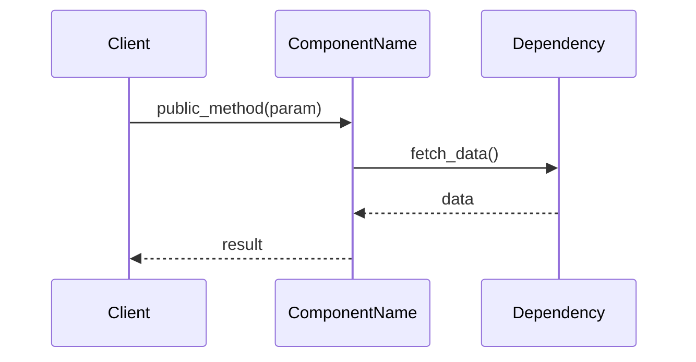
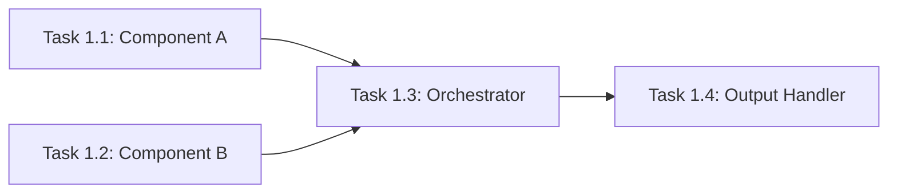
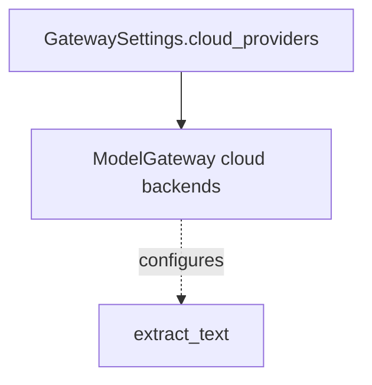
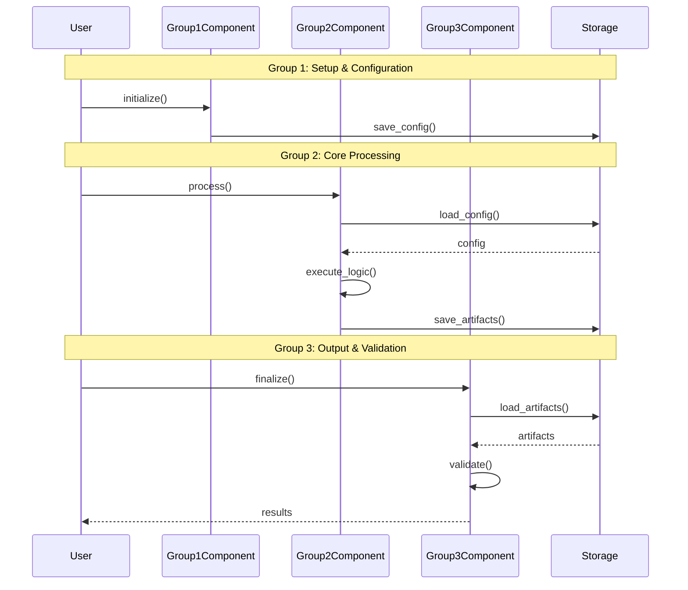
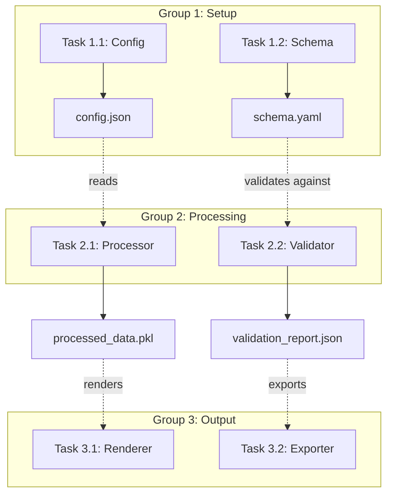
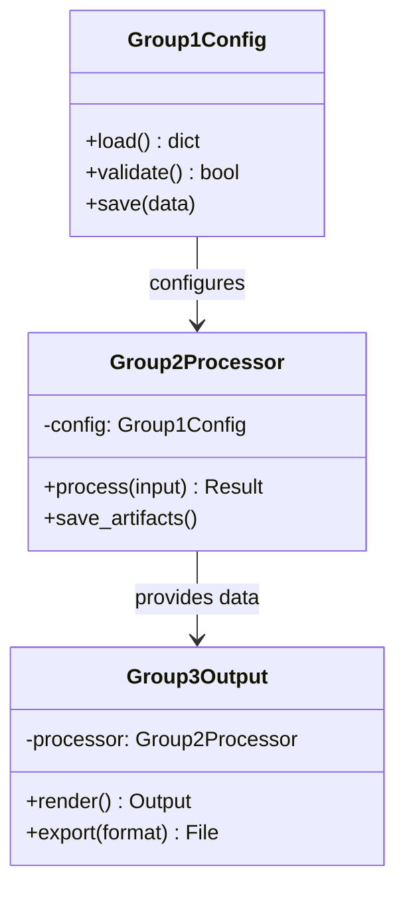
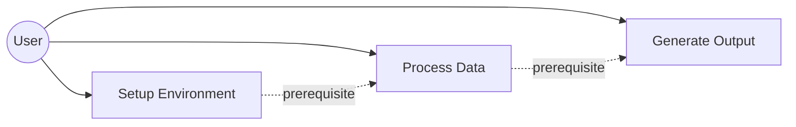
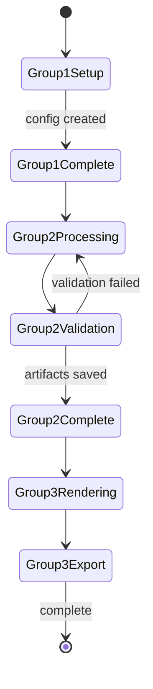
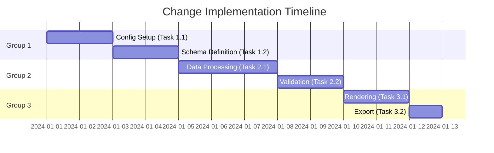

# Generate Implementation Guides from OpenSpec Tasks

Generate concise, visual implementation guides from OpenSpec `tasks.md` files, focused on APIs, file changes, and interaction flows.

In below, `<change-name>` is the OpenSpec change directory name (e.g., `add-dark-mode`, `refactor-auth`). You should check `openspec/changes/` directory for these change subdirectories.

## Input

Read `openspec/changes/<change-name>/tasks.md` from the current change.

## Output Location

Save guides to: `openspec/changes/<change-name>/impl-guides/grp<id>-<what>.md`

Example: `openspec/changes/add-dark-mode/impl-guides/grp1-setup.md`

## Backlink in `tasks.md` (if provided)

If the user provides `openspec/changes/<change-name>/tasks.md` as input (or asks you to generate guides for an existing `tasks.md`), also revise that `tasks.md` file to add references to the generated implementation guides so readers can find them.

Recommended approach: add a short `## Implementation Guides` section near the top of `openspec/changes/<change-name>/tasks.md` (before the first task group), listing:
- `openspec/changes/<change-name>/impl-guides/grp<id>-<what>.md` (per group)
- `openspec/changes/<change-name>/impl-guides/impl-integrate-groups.md` (integration guide)

Keep the existing task checklist format intact (do not change task IDs or checkbox lines when adding the reference section).

## Guide Structure

~~~markdown
# Implementation Guide: [Group Name]

**Group**: [Number] | **Change**: [Name] | **Tasks**: [X.1]–[X.Y]

## Goal

[what this group of tasks aims to achieve, from tasks.md]

## Public APIs

### Task [X.1]: [Task Title]

[1-2 sentence description of what this task delivers]

```python
# src/module/component.py

class ComponentName:
    """Brief description of component purpose.

    Responsibilities:
    - Responsibility 1
    - Responsibility 2
    """

    def public_method(self, param: Type) -> ReturnType:
        """What this method does and why.

        Args:
            param: What this parameter represents

        Returns:
            What the return value means

        Example:
            >>> obj = ComponentName()
            >>> result = obj.public_method(value)
        """
        pass
```

**Usage Flow**:

Mermaid `sequenceDiagram` figures MUST follow `magic-context/instructions/mermaid-seq-styling.md`.



**Pseudocode**:

```python
# High-level logic for complex operations
def public_method(param):
    # 1. Validate input
    validate(param)

    # 2. Fetch dependencies
    data = dependency.fetch()

    # 3. Process
    result = process(data, param)

    # 4. Return
    return result
```

---

[Repeat for each task in group]

## Group Integration



## Testing

### Test Input

Describe the concrete inputs required for testing this group, including:

- Configuration files or JSON/YAML inputs under a workspace temp directory
  (for example `<workspace>/tmp/<subdir-created-by-previous-groups>/config.yaml`)
- Any seed data or fixtures produced by earlier groups and stored under
  `<workspace>/tmp/<subdir-created-by-previous-groups>/`
- External resources or environment variables that must exist *before* running tests

Be explicit about paths and assumptions so tests are reproducible.

### Test Procedure

Step-by-step instructions for running the tests for this group, explicitly
showing **how the Test Input artifacts are used**. For example, reference the
paths from the Test Input section when invoking your code or test runner:

```bash
# Run unit tests for this group
pixi run pytest tests/unit/feature/

# Run integration tests for this group
pixi run pytest tests/integration/feature/test_group_*.py
```

Include any additional commands or orchestration needed (e.g., starting local
services), and clearly map each step to the specific input files or resources
listed in **Test Input** so the procedure is reproducible end-to-end.

### Test Output

Describe the expected outcomes when tests pass, such as:

- Console output (for example, `N passed, 0 failed`)
- Generated artifacts (for example, files under
  `<workspace>/tmp/<subdir-created-by-previous-groups>/<what>/`)
- Logs or reports (for example, coverage reports or JSON summaries)

If there are known failure modes that indicate partial success, document them here as well.

## References
- Proposal: `openspec/changes/<change-name>/proposal.md`
- Design: `openspec/changes/<change-name>/design.md`
- Specs: `openspec/changes/<change-name>/specs/`

## Implementation Summary

- This should be filled after implementation is done.
- During planing phase, you can leave it blank with some placeholder text.
- After implementation, fill it with 2-3 paragraphs about the high-level implementation approach for this group. And then fill in the sub-sections below.

### What has been implemented

(after implementation)
- List the created/modified files and their roles.
- Summarize key classes, functions, or modules introduced.

### How to verify

(after implementation)
- Describe how to run tests and validate functionality.
- Must include prerequisites, commands, and expected results.

~~~

## Guidelines

1. **APIs First**: Show public interfaces with typed signatures and docstrings
2. **Language Match**: Use Python/TypeScript/Go/etc. based on project language
3. **Diagrams**: Use Mermaid sequence/graph diagrams for flows and dependencies; `sequenceDiagram` MUST follow `magic-context/instructions/mermaid-seq-styling.md`
4. **Concise**: Focus on *what* and *how*, skip verbose explanations
5. **Concrete**: Real file paths, class names, function signatures. Prefer repo-relative paths (e.g., `src/...`, `tests/...`); if you need a workspace root placeholder, follow surrounding docs (this repo commonly uses `<workspace>/...`, but use `<workspace-root-placeholder>/...` if that’s the established style); use absolute paths only when surrounding docs use absolute paths.
6. **Testable**: Include test commands and validation steps

### Mermaid troubleshooting: `Parse error ... Expecting 'SQE' ...`

This shows up frequently in Mermaid `graph` / `flowchart` diagrams, often with messages like:

```text
Error: Parse error on line 3:
...GatewaySettings.cloud_providers()]        P2A3[MDX
-----------------------^
Expecting 'SQE', ...
```

Common triggers (and fixes):

- **Function-call labels in nodes**: avoid `()` in `[...]` node labels. Prefer `GatewaySettings.cloud_providers` (describe the call in surrounding text instead).
- **Wildcards in labels**: avoid `*` in node labels (write `MDX env vars` instead of `MDX_* env vars`).
- **Edge “dotted label” syntax**: avoid `-.label.->`; use `-.->|label|` instead (works across more Mermaid versions).
- **Line separators**: add `;` at the end of each edge line to avoid issues when renderers collapse newlines.

Bad (often triggers parse errors):

```mermaid
graph TD
  A[GatewaySettings.cloud_providers()] --> B[ModelGateway cloud backends]
  B -.configures.-> C[extract_text]
```

Good (more robust):



---

## Integration Guide

**In addition to individual group guides**, create a comprehensive integration guide showing how all groups work together.

### Output Location

Save to: `openspec/changes/<change-name>/impl-guides/impl-integrate-groups.md`

Example: `openspec/changes/add-dark-mode/impl-guides/impl-integrate-groups.md`

### Integration Guide Structure

~~~markdown
# Integration Guide: [Change Name]

**Change**: `<change-name>` | **Groups**: [Total Count]

## Overview

[1-2 paragraphs explaining how groups connect and build upon each other]

## Group Flow

**MUST HAVE: End-to-End Sequence Diagram**



## Artifact Flow Between Groups



## System Architecture



## Use Cases



## Activity Flow



## Inter-Group Dependencies

### Group 1 → Group 2

**Artifacts**:
- `config/settings.json` - Configuration created by Task 1.1, consumed by Task 2.1
- `schemas/data_model.yaml` - Schema defined by Task 1.2, used by Task 2.2

**Code Dependencies**:
```python
# Group 2 uses Group 1 components
from group1.config import ConfigLoader
from group1.schema import SchemaValidator

class Group2Processor:
    def __init__(self):
        self.config = ConfigLoader.load()  # Uses Group 1 artifact
        self.validator = SchemaValidator(self.config.schema_path)
```

### Group 2 → Group 3

**Artifacts**:
- `data/processed/*.pkl` - Processed data from Task 2.1, input for Task 3.1
- `reports/validation.json` - Validation results from Task 2.2, used by Task 3.2

**Code Dependencies**:
```python
# Group 3 uses Group 2 components and artifacts
from group2.processor import DataProcessor
from group2.models import ProcessedData

class Group3Renderer:
    def __init__(self, data_path: str):
        self.data = ProcessedData.load(data_path)  # Group 2 artifact
```

## Data Flow Timeline



## Integration Testing

```bash
# Test complete group integration
pixi run pytest tests/integration/feature/test_end_to_end.py

# Test group-to-group handoffs
pixi run pytest tests/integration/feature/test_group1_to_group2.py
pixi run pytest tests/integration/feature/test_group2_to_group3.py

# Validate artifacts
pixi run python scripts/validate_group_artifacts.py --change <change-name>
```

## Critical Integration Points

1. **Group 1→2 Handoff**: Configuration must be valid and accessible
   - Files: `config/settings.json`, `schemas/*.yaml`
   - Validation: Schema validation passes before Group 2 starts

2. **Group 2→3 Handoff**: Processed data must be in expected format
   - Files: `data/processed/*.pkl`, `reports/*.json`
   - Validation: Data integrity checks pass before Group 3 starts

## References
- Individual group guides: `openspec/changes/<change-name>/impl-guides/grp*.md`
- Proposal: `openspec/changes/<change-name>/proposal.md`
- Tasks breakdown: `openspec/changes/<change-name>/tasks.md`
- Design: `openspec/changes/<change-name>/design.md`
- Specs: `openspec/changes/<change-name>/specs/`
~~~

### Integration Guide Requirements

1. **Sequence Diagram (MANDATORY)**: Show complete end-to-end flow across all groups
2. **Artifact Flow Diagram**: Illustrate how files/data move between groups
3. **Class Diagram**: Show architectural relationships between group components
4. **Use Case Diagram**: Document user interactions across groups
5. **Activity/State Diagrams**: Show group transitions and decision points
6. **Inter-Group Dependencies**: List concrete code and artifact dependencies
7. **Integration Tests**: Commands to validate group integration
8. **Critical Handoff Points**: Document group transition requirements

### When to Create Integration Guide

Create the integration guide:
- **After** all individual group guides are complete
- **Before** starting implementation
- Update as groups are implemented and integration points are refined
