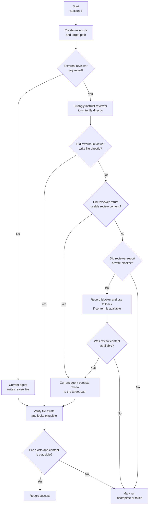

# OpenSpec Extension: Review Plan

Review an OpenSpec change and produce a concrete, thread-friendly review report.

**Output:** Write to `CHANGE_DIR/review/review-YYYYMMDD-HHMMSS.md` (create `review/` if missing).

## Prerequisites

No external agent is required by default.

Run the review directly in the current agent unless the user explicitly asks to use an external reviewer.

If (and only if) the user explicitly requests external review:

- `claude`, `claude code`, and `claude-<suffix>` require `$claude-code-invoke-once`
- `copilot` and `copilot-<suffix>` require `$copilot-invoke-once`

Treat `claude-<suffix>` as Claude Code with wrapper handling, and treat `copilot-<suffix>` as Copilot with wrapper handling.

If the requested external dependency (after normalization to Claude or Copilot family) is missing, report a clear error listing the missing skill and do not attempt an ad-hoc fallback command.

## Workflow

### 1) Select The Change To Review

- If the user specifies a change name, use it.
- Otherwise, infer the “current” change from conversation context (the change the user is already discussing/implementing).
- If you still cannot determine it, list available changes and ask the user to pick one:

  ```bash
  openspec list --sort recent --json
  ```

  Show the most recent 3-6 changes with their task counts/status, mark the most recent as “(Recommended)”, then ask which to review.
  If your harness has an “AskUserQuestion” tool, use it; otherwise ask in plain text.

### 2) Load Change Artifacts (And Locate CHANGE_DIR)

1. Check schema + artifact status:

   ```bash
   openspec status --change "<change-name>" --json
   ```

2. Get change directory + context files:

   ```bash
   openspec instructions apply --change "<change-name>" --json
   ```

   Parse:
   - `changeDir` (this is `CHANGE_DIR`)
   - `contextFiles` (proposal/specs/design/tasks, depending on schema)

3. Read all available artifacts listed by `contextFiles`.
   If any entry is a glob (example: `specs/**/*.md`), expand it by listing files on disk.

### 3) Perform The Review

Cover at least:

- **Completeness:** Are required artifacts present for the schema? Are tasks concrete and ordered?
- **Internal coherence:** Do specs match design? Does design justify tasks? Any contradictions or missing invariants?
- **Design alignment with the existing system:**
  - Identify the impacted modules and existing architectural patterns in the repo.
  - Check whether the proposed design follows those patterns (naming, layering, config, error semantics, boundaries).
  - Call out mismatches with concrete file/path references and suggest a more “native” approach.
- **Risk and testability:** What could break? What needs unit vs integration tests?

When uncertain, be explicit about uncertainty and turn it into an open question or a suggested validation step.

### 4) Write The Review Report

1. **Prepare the output path.**
   - Ensure `CHANGE_DIR/review/` exists.
   - Target `review-YYYYMMDD-HHMMSS.md` using a UTC timestamp.
   - Include an ISO-8601 timestamp in the report header.

2. **If the review is local, write it directly.**
   - The current agent writes the review file itself.

3. **If the user explicitly requested an external reviewer, prefer direct-write first.**
   - Instruct the external reviewer, in strong and explicit terms, to write the review file directly at the exact target path.
   - Tell it to create the parent `review/` directory if needed.
   - Ask it to return only a short completion message after writing the file.

4. **Use fallback persistence only when needed.**
   - If the external reviewer writes the file directly, verify the file and finish.
   - If the external reviewer returns usable review content via stdout/chat instead of writing the file, persist that content yourself at the expected review path.
   - If the external reviewer reports a real write blocker, record that blocker and use the same fallback path when review content is available.

5. **Do not report success until the file exists and looks plausible.**
   - If the expected file exists and contains review content, the run succeeded.
   - If no file exists and no usable review content was returned, treat the run as incomplete or failed.



## Review Report Template

Use this header (and keep it stable so reviews are easy to diff/scan):

```markdown
# OpenSpec Change Review: <change-name>

- Change: `<change-name>`
- Schema: `<schema-name>`
- Timestamp: `<YYYY-MM-DDTHH:MM:SSZ>`
- Artifacts reviewed:
  - <path>
  - <path>
  - ...

## Response Format (Proposal / Decision Contract)

When responding to open questions in this review, use paired `PROPOSED` and `DECISION` blockquotes immediately after each question's `Options` subsection:

```markdown
> **PROPOSED: <one-line recommended answer>.**
> Rationale: <codebase-grounded justification with concrete evidence>.
>
> **DECISION: _(pick PROPOSED solution if not filled by developer)_**
> Rationale: _To be filled by developer._
```

Rationale contract:

- Ground the `PROPOSED` rationale in repository evidence (specific paths, symbols, and line numbers when possible).
- Explain why the proposed option fits existing architecture/patterns better than alternatives.
- Summarize the key tradeoffs directly in the `PROPOSED` rationale instead of using a separate pros/cons subsection.
- Call out implementation implications (new fields/errors/tests/migrations) when applicable.
- When useful, include concise Markdown fenced code blocks to show the exact branch, API shape, or state transition under discussion.
- Keep rationale concise and concrete (typically 2-5 sentences).
- Do not add reviewer rationale anywhere under `DECISION`; all reviewer explanation belongs in `PROPOSED`.

Reviewer / developer ownership contract:

- The reviewing agent must fill only the `PROPOSED` blockquote.
- The reviewing agent must explain its reasoning only in the `PROPOSED` blockquote.
- The reviewing agent must leave the `DECISION` blockquote as a developer-owned placeholder.
- The reviewing agent must not edit the `DECISION` summary or its rationale placeholder text.
- The developer fills the `DECISION` blockquote later, after choosing whether to accept, modify, or reject the proposal.

Placement contract:

- Insert both blockquotes directly after the `Options` subsection for that question.
- Keep any follow-ups after the `DECISION` block so outcomes remain easy to scan.

## Summary

- <2-6 bullets: what’s solid + what’s risky>

## Findings

### Must Fix / Blocking

- ...

### Should Fix / Important

- ...

### Nice To Have

- ...

## Design Alignment With Existing System

- Existing pattern(s) observed: <paths / modules>
- Proposed design alignment: <aligns/mismatches + concrete suggestions>

## Open Questions (Reviewer Proposal / Developer Decision)

### Q1) <crisp question>

<!-- Classification: mark every question -->
- Decision: `Blocking` | `Deferrable`

#### Why this matters

- ...

#### Examples

- <concrete scenario showing ambiguity in behavior/output>
- <optional edge case highlighting tradeoffs>

#### Why this question arises in code

- <where ambiguity appears: files/modules/code paths>
- <which branch/condition/state transition is currently undecided>
- <include a short fenced Markdown code block when it clarifies the decision point>

#### Options

**Option A: ...**

- Code impact:
  - <how this maps to code paths/data flow; include short pseudo code in a fenced Markdown code block when helpful>
- User-facing difference:
  - <observable UX/output/error/ops difference>
- Pros:
  - ...
- Cons:
  - ...

**Option B: ...**

- Code impact:
  - <how this maps to code paths/data flow; include short pseudo code in a fenced Markdown code block when helpful>
- User-facing difference:
  - <observable UX/output/error/ops difference>
- Pros:
  - ...
- Cons:
  - ...

> **PROPOSED: <one-line recommended answer>.**
> Rationale: <codebase-grounded justification with concrete evidence>.
>
> **DECISION: _(pick PROPOSED solution if not filled by developer)_**
> Rationale: _To be filled by developer._

## Suggested Next Steps

1) <concrete next step>
2) <concrete next step>
```

## External Review Agent Support

Use external review agents only when the user explicitly requests them.

Supported external reviewer commands:

- `claude` / `claude code`
- `copilot`
- `claude-<suffix>` (alias of Claude Code with wrapper handling)
- `copilot-<suffix>` (alias of Copilot with wrapper handling)

If the user does not specify an external reviewer, perform the review directly in the current agent.

Agent-specific requirements (only when explicitly requested):

- For Claude (`claude`, `claude code`, or `claude-<suffix>`), use Claude Code with an Opus model.
- Invocation details for Claude Code are delegated to `$claude-code-invoke-once`; follow that skill for exact command/session/flag handling.
- For Copilot (`copilot` or `copilot-<suffix>`), use the latest Opus model with high reasoning effort.
- Invocation details for `copilot` are delegated to `$copilot-invoke-once`; follow that skill for exact command/config composition.
- For wrapper-style reviewer names (for example, `claude-<suffix>` / `copilot-<suffix>`), rely on the underlying invocation skill to resolve and handle wrapper-specific command details.

External-agent prompt contract:

- Tell the external agent the exact absolute output path it must write.
- Tell the external agent to create the parent `review/` directory if needed.
- Tell the external agent, in strong and explicit terms, that it should write the review report directly to disk at that path instead of returning the full Markdown to the caller.
- Tell the external agent that direct file writing is the preferred primary output mode, and that if it cannot do that it should either report the blocker explicitly or return the completed review content for fallback persistence.
- Tell the external agent to write the review incrementally if it prefers; do not require it to return the full review as one final response.
- Ask the external agent to return a short completion message only, ideally confirming the written path and any notable caveat.
- After the invocation, locally verify the file exists instead of assuming success from the external agent's text response alone.

External-agent fallback policy:

- If the external agent reports a real write blocker, capture that blocker explicitly in your own notes or response before considering any fallback.
- If the file was not written but the external agent returned usable review content in stdout/chat output, treat that content as fallback material and persist it yourself at the expected review path.
- Prefer direct-write first, but do not discard a good external review just because it arrived through stdout instead of a file write.
- When fallback writing is used, note in your own final response whether the external agent wrote the file directly or whether you persisted its returned review content.

External-agent runtime policy:

- Use a default timeout budget of 20 minutes for the external review run unless the user explicitly requests a different deadline.
- Treat that timeout as a check-in threshold, not an automatic kill threshold.
- If the external agent is still running at the timeout threshold and has not entered an error state, leave it running in the background and ask the user whether they want to terminate it or let it continue.
- Do not kill a long-running external review agent merely because the timeout budget elapsed; external-agent runs consume paid/query-limited tokens, so killing an otherwise healthy run is wasteful.
- Only terminate automatically when the external agent has clearly fallen into an error state such as connection loss, process death, authentication failure, or rate-limit failure.

## Guardrails

- Do not silently switch changes; always confirm the chosen change when selection was ambiguous.
- Prefer actionable feedback over vague opinions; cite concrete artifacts/paths.
- Keep “Open Questions” as a separate section and include both a reviewer-filled `PROPOSED` block and a developer-owned `DECISION` placeholder for each question.
- Default behavior is in-agent review (no external reviewer) unless the user explicitly requests an external reviewer.
- Normalize reviewer aliases before dispatch: `claude-<suffix>` -> Claude Code family; `copilot-<suffix>` -> Copilot family.
- If the user requests Claude (`claude`, `claude code`, or `claude-<suffix>`), require Claude Code + Opus model, and defer exact invocation mechanics to `$claude-code-invoke-once`.
- If the user requests Copilot (`copilot` or `copilot-<suffix>`), require latest Opus model + high reasoning effort, and defer exact invocation mechanics to `$copilot-invoke-once`.
- For wrapper-style reviewer names, let the underlying invocation skill handle wrapper-specific execution details.
- If the requested external invocation skill is unavailable for the normalized family, refuse that external path and report the missing dependency instead of attempting ad-hoc fallback commands.
- Do NOT assume an external agent has this skill installed or can read files from this repo.
  - Construct a plain prompt that includes all instructions from this skill (paste the contents of this `SKILL.md`), plus the selected change name (if known), and ask the other agent to execute the workflow and write the review report directly at the specified output path.
- Do not prefer a "return the full Markdown review in stdout" pattern for external review unless direct file writing is impossible in that agent environment.
- Treat external review success as `file written and verified`, not merely `agent said it finished`.
- For external review runs, default the timeout budget to 20 minutes and do not convert timeout expiry into automatic termination.
- If timeout is reached without an error state, background the run if needed, preserve its session/process identity, and ask the user whether termination should proceed.
- Only auto-terminate external review processes when they are already in a hard failure state and cannot continue usefully.
