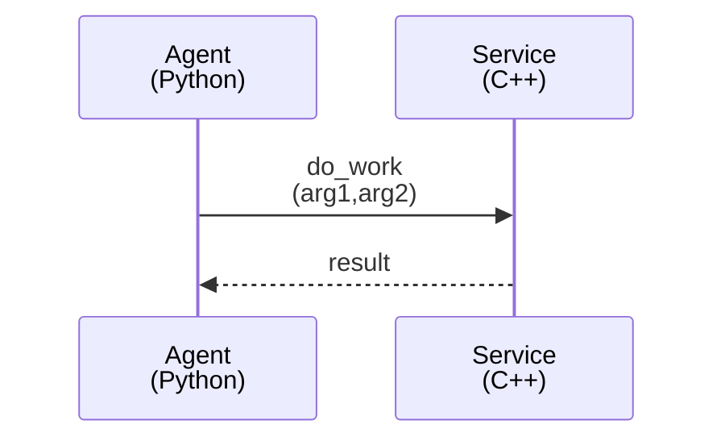
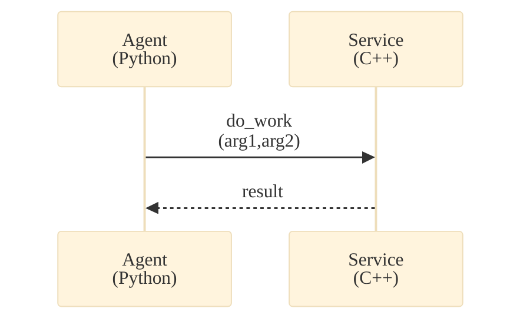

# Mermaid Graphing

## When to Use This Skill

- You are writing `.md` docs/notes and want diagrams that render in-place via Mermaid.
- You need to document control flow, module interactions, or call flows (especially `sequenceDiagram`).
- Your diagrams are getting too wide or unreadable and need styling/wrapping rules.

## Core Rules

- Always use fenced code blocks with the `mermaid` info string (Mermaid does not render reliably as “inline” Markdown).
- Prefer clarity over completeness: split complex flows into multiple diagrams.
- Keep labels short and wrap with HTML breaks (`<br/>`) when needed. Mermaid does not support raw `\n` line breaks in labels.
- Never break important identifiers (function/class names) across lines; wrap around separators or move context to a new line.

## Markdown Embedding (Correct Pattern)

```markdown

```

Notes:
- `sequenceDiagram` keyword must be lowercase.
- Keep one diagram per code block; do not mix Mermaid and non-Mermaid text inside the fence.

## Styling and Layout (Avoid Wide Diagrams)

Most “bad” Mermaid diagrams are too wide because participant labels and message labels are long. Fix width first by:

- Using short participant IDs, and putting the long readable label in `as ...`.
- Wrapping long labels with `<br/>` (wrap the label, not the ID).
- Shortening repeated prefixes by declaring an alias once (participant label), then using the short ID everywhere.

For sequence diagrams, use the dedicated guide: `references/sequence-diagram-styling.md`.

## Diagram Init/Theme (Optional)

If your renderer supports Mermaid init blocks, you can apply consistent styling per diagram:



If the init block does not render, remove it and fall back to label-wrapping and short IDs (these work everywhere).

## Quick Checklist (Before Shipping a Diagram)

- [ ] Diagram renders without horizontal scrolling in the target renderer.
- [ ] Labels use `<br/>` for wrapping; no raw `\n` escapes.
- [ ] Function/class names remain intact (no mid-identifier line breaks).
- [ ] Complex flows are split into multiple diagrams.
- [ ] Diagram validated in Mermaid Live Editor when styling/rendering is uncertain.

## Troubleshooting

See `troubleshoot.md` for common Mermaid parse errors and fixes (especially flowchart node labels that include `<br/>` and parentheses).
