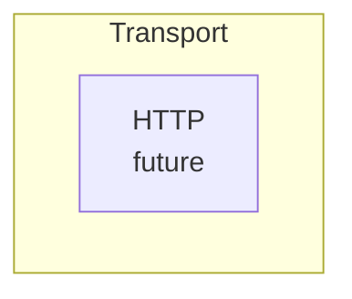

# Troubleshooting Mermaid Diagrams

This doc collects common Mermaid errors seen in Markdown renderers (GitHub, MkDocs plugins, internal docs sites, etc.) and the most reliable fixes.

## Flowchart parse error with `<br/>` in node labels

### Symptom

You see an error like:

- `Error: Parse error on line N: ... Expecting ...`
- The caret (`^`) points at `end` in a `subgraph`, even though the diagram *looks* structurally correct.

One common trigger is a flowchart node label that includes an HTML break and other punctuation (like parentheses) without quoting, for example:

```mermaid
flowchart TD
    subgraph Transport
        HTTP[HTTP<br/>(future)]
    end
```

### Why it happens

Mermaid renderer versions differ. Some parsers are stricter about special characters (like `<` / `>` from `<br/>`) inside the unquoted `A[Label]` syntax and will fail to tokenize the node label correctly.

When this happens inside a `subgraph`, the parser often reports the error at the `end` line, but the actual problem is the node line above it.

### Fix (recommended)

Quote the label using the `A["..."]` form whenever the label contains `<br/>`, parentheses, or other special characters:



Notes:

- Quoting the label is safe even for “simple” labels, and tends to work across more renderers.
- Prefer wrapping the *label* with `<br/>`, not the node ID (`HTTPep` stays short; the readable text goes in quotes).
