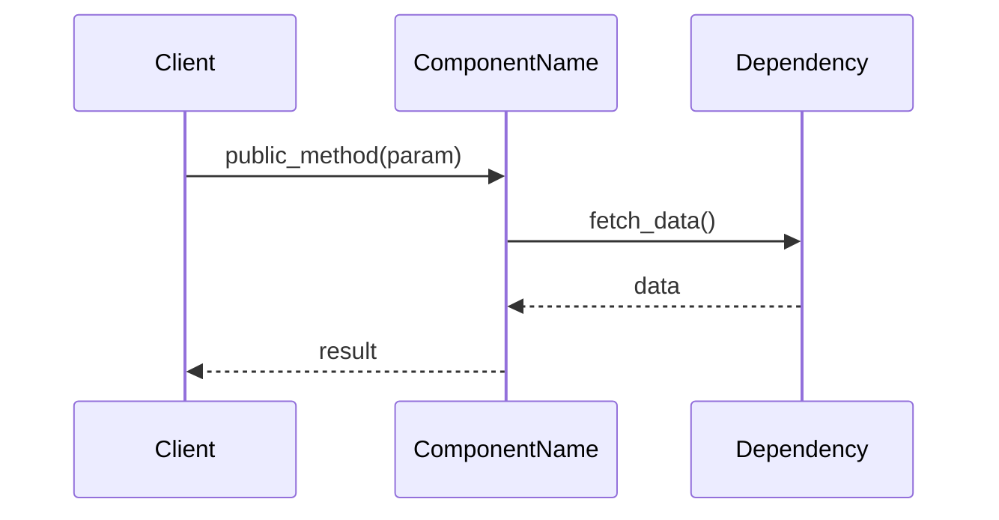
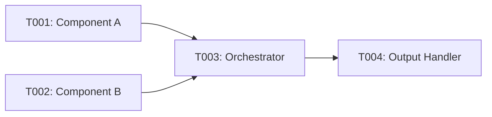
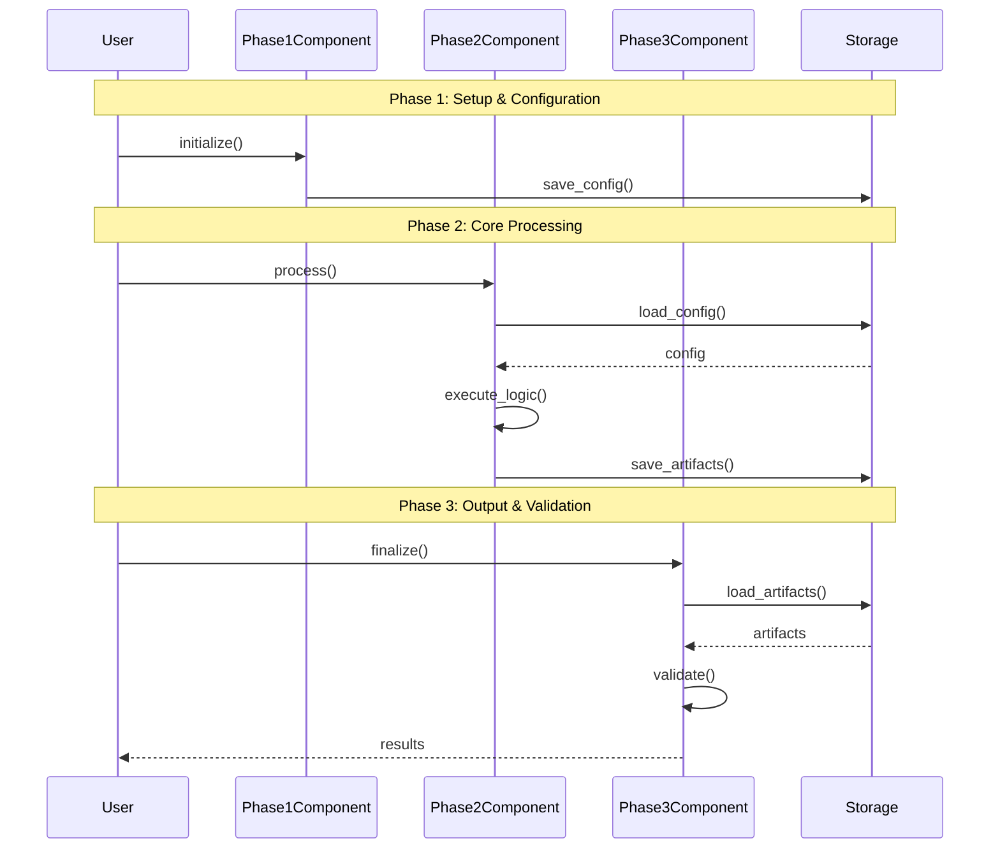
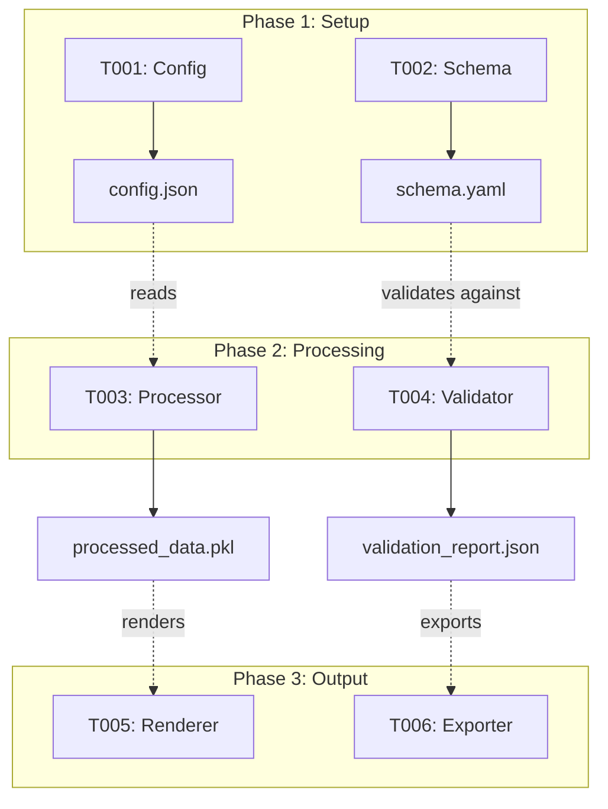
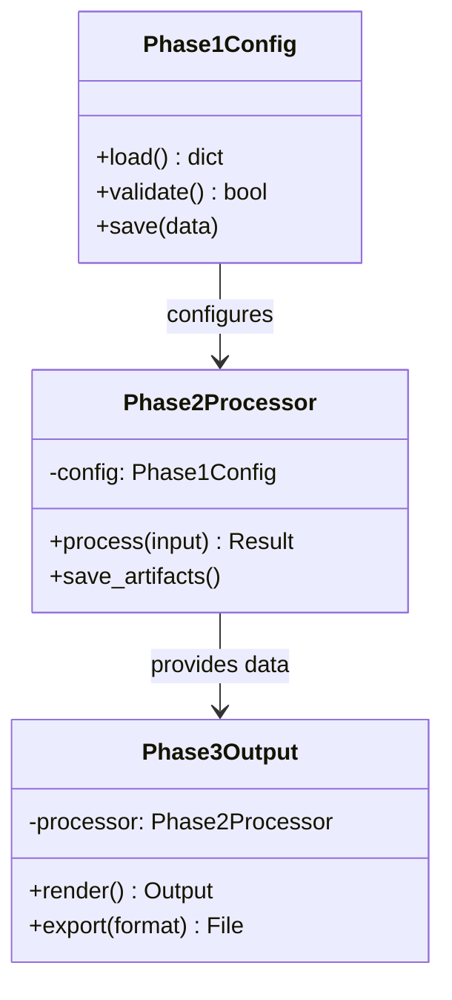
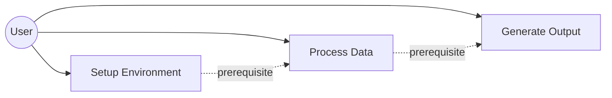
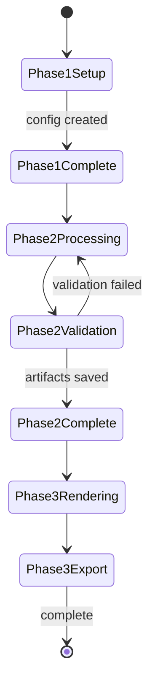
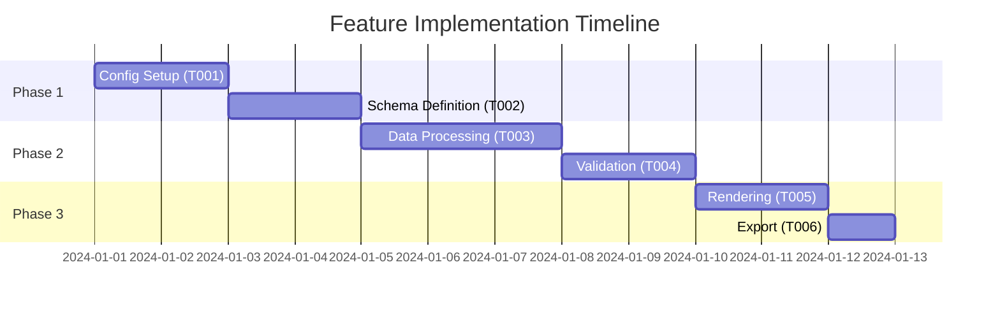

# Generate Implementation Guides from Speckit Tasks

Generate concise, visual implementation guides from speckit `tasks.md` files, focused on APIs, file changes, and interaction flows.

In below, `<feature-id>` is the speckit feature directory name with format `<feature-index>-<feature-name>` (e.g., `001-my-feature`, `002-blender-rendering`). You should check `specs/` directory for these feature subdirectories.

## Input

Read `specs/<feature-id>/tasks.md` from the current feature (infer from git branch or ask user).

## Output Location

Save guides to: `context/tasks/<feature-id>/impl-phase-<id>-<what>.md`

Note that, according to speckit conventions, `<feature-id>` is the same as git branch name (format: `<feature-index>-<feature-name>`), and you shall be able to find `specs/<feature-id>/` subdir.

Example: `context/tasks/001-my-feature/impl-phase-1-setup.md`

## Guide Structure

~~~markdown
# Implementation Guide: [Phase Name]

**Phase**: [Number] | **Feature**: [Name] | **Tasks**: T[XXX]–T[YYY]

## Goal

[what this phase aims to achieve, from tasks.md]

## Public APIs

### T[XXX]: [Task Title]

[1-2 sentence description of what this task delivers]

```python
# src/module/component.py

class ComponentName:
    """Brief description of component purpose.

    Responsibilities:
    - Responsibility 1
    - Responsibility 2
    """

    def public_method(self, param: Type) -> ReturnType:
        """What this method does and why.

        Args:
            param: What this parameter represents

        Returns:
            What the return value means

        Example:
            >>> obj = ComponentName()
            >>> result = obj.public_method(value)
        """
        pass
```

**Usage Flow**:



**Pseudocode**:

```python
# High-level logic for complex operations
def public_method(param):
    # 1. Validate input
    validate(param)

    # 2. Fetch dependencies
    data = dependency.fetch()

    # 3. Process
    result = process(data, param)

    # 4. Return
    return result
```

---

[Repeat for each task in phase]

## Phase Integration



## Testing

### Test Input

Describe the concrete inputs required for testing this phase, including:

- Configuration files or JSON/YAML inputs under a workspace temp directory
  (for example `<workspace>/tmp/<subdir-created-by-previous-phases>/config.yaml`)
- Any seed data or fixtures produced by earlier phases and stored under
  `<workspace>/tmp/<subdir-created-by-previous-phases>/`
- External resources or environment variables that must exist *before* running tests

Be explicit about paths and assumptions so tests are reproducible.

### Test Procedure

Step-by-step instructions for running the tests for this phase, explicitly
showing **how the Test Input artifacts are used**. For example, reference the
paths from the Test Input section when invoking your code or test runner:

```bash
# Run unit tests for this phase
pixi run pytest tests/unit/feature/

# Run integration tests for this phase
pixi run pytest tests/integration/feature/test_phase_*.py
```

Include any additional commands or orchestration needed (e.g., starting local
services), and clearly map each step to the specific input files or resources
listed in **Test Input** so the procedure is reproducible end-to-end.

### Test Output

Describe the expected outcomes when tests pass, such as:

- Console output (for example, `N passed, 0 failed`)
- Generated artifacts (for example, files under
  `<workspace>/tmp/<subdir-created-by-previous-phases>/<what>/`)
- Logs or reports (for example, coverage reports or JSON summaries)

If there are known failure modes that indicate partial success, document them here as well.

## References
- Spec: `specs/<feature-id>/spec.md`
- Data model: `specs/<feature-id>/data-model.md`
- Contracts: `specs/<feature-id>/contracts/`

## Implementation Summary

- This should be filled after implementation is done.
- During planing phase, you can leave it blank with some placeholder text.
- After implementation, fill it with 2-3 paragraphs about the high-level implementation approach for this phase. And then fill in the sub-sections below.

### What has been implemented

(after implementation)
- List the created/modified files and their roles.
- Summarize key classes, functions, or modules introduced.

### How to verify

(after implementation)
- Describe how to run tests and validate functionality.
- Must include prerequisites, commands, and expected results.

~~~

## Guidelines

1. **APIs First**: Show public interfaces with typed signatures and docstrings
2. **Language Match**: Use Python/TypeScript/Go/etc. based on project language
3. **Diagrams**: Use Mermaid sequence/graph diagrams for flows and dependencies
4. **Concise**: Focus on *what* and *how*, skip verbose explanations
5. **Concrete**: Real file paths, class names, function signatures
6. **Testable**: Include test commands and validation steps

---

## Phase Integration Guide

**In addition to individual phase guides**, create a comprehensive integration guide showing how all phases work together.

### Output Location

Save to: `context/tasks/<feature-id>/impl-integrate-phases.md`

Example: `context/tasks/001-my-feature/impl-integrate-phases.md`

### Integration Guide Structure

~~~markdown
# Phase Integration Guide: [Feature Name]

**Feature**: `<feature-id>` | **Phases**: [Total Count]

## Overview

[1-2 paragraphs explaining how phases connect and build upon each other]

## Phase Flow

**MUST HAVE: End-to-End Sequence Diagram**



## Artifact Flow Between Phases



## System Architecture



## Use Cases



## Activity Flow



## Inter-Phase Dependencies

### Phase 1 → Phase 2

**Artifacts**:
- `config/settings.json` - Configuration created by T001, consumed by T003
- `schemas/data_model.yaml` - Schema defined by T002, used by T004

**Code Dependencies**:
```python
# Phase 2 uses Phase 1 components
from phase1.config import ConfigLoader
from phase1.schema import SchemaValidator

class Phase2Processor:
    def __init__(self):
        self.config = ConfigLoader.load()  # Uses Phase 1 artifact
        self.validator = SchemaValidator(self.config.schema_path)
```

### Phase 2 → Phase 3

**Artifacts**:
- `data/processed/*.pkl` - Processed data from T003, input for T005
- `reports/validation.json` - Validation results from T004, used by T006

**Code Dependencies**:
```python
# Phase 3 uses Phase 2 components and artifacts
from phase2.processor import DataProcessor
from phase2.models import ProcessedData

class Phase3Renderer:
    def __init__(self, data_path: str):
        self.data = ProcessedData.load(data_path)  # Phase 2 artifact
```

## Data Flow Timeline



## Integration Testing

```bash
# Test complete phase integration
pixi run pytest tests/integration/feature/test_end_to_end.py

# Test phase-to-phase handoffs
pixi run pytest tests/integration/feature/test_phase1_to_phase2.py
pixi run pytest tests/integration/feature/test_phase2_to_phase3.py

# Validate artifacts
pixi run python scripts/validate_phase_artifacts.py --feature <feature-id>
```

## Critical Integration Points

1. **Phase 1→2 Handoff**: Configuration must be valid and accessible
   - Files: `config/settings.json`, `schemas/*.yaml`
   - Validation: Schema validation passes before Phase 2 starts

2. **Phase 2→3 Handoff**: Processed data must be in expected format
   - Files: `data/processed/*.pkl`, `reports/*.json`
   - Validation: Data integrity checks pass before Phase 3 starts

## References
- Individual phase guides: `context/tasks/<feature-id>/impl-phase-*.md`
- Spec: `specs/<feature-id>/spec.md`
- Tasks breakdown: `specs/<feature-id>/tasks.md`
- Data model: `specs/<feature-id>/data-model.md`
- Contracts: `specs/<feature-id>/contracts/`
~~~

### Integration Guide Requirements

1. **Sequence Diagram (MANDATORY)**: Show complete end-to-end flow across all phases
2. **Artifact Flow Diagram**: Illustrate how files/data move between phases
3. **Class Diagram**: Show architectural relationships between phase components
4. **Use Case Diagram**: Document user interactions across phases
5. **Activity/State Diagrams**: Show phase transitions and decision points
6. **Inter-Phase Dependencies**: List concrete code and artifact dependencies
7. **Integration Tests**: Commands to validate phase integration
8. **Critical Handoff Points**: Document phase transition requirements

### When to Create Integration Guide

Create the integration guide:
- **After** all individual phase guides are complete
- **Before** starting implementation
- Update as phases are implemented and integration points are refined
