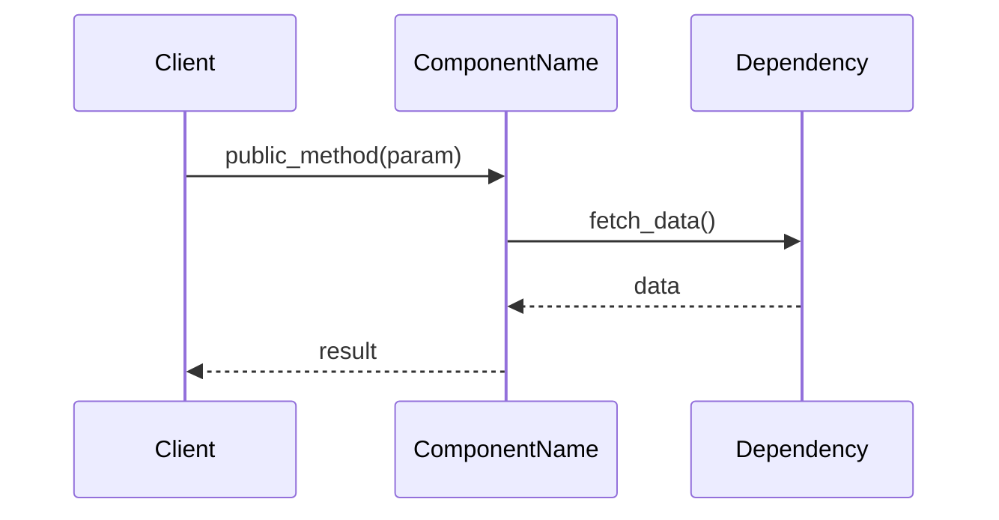
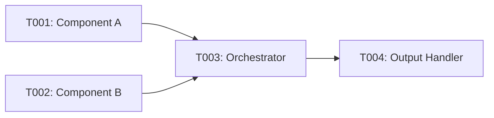

# Generate Implementation Guides from Speckit Tasks

Generate concise, visual implementation guides from speckit `tasks.md` files, focused on APIs, file changes, and interaction flows.

In below, `feature-id` matches the speckit feature directory name, you should check `specs/`, those dirs are like `001-xxx-yyy`, `002-aaa-bbb`, etc.

## Input

Read `specs/<feature-id>/tasks.md` from the current feature (infer from git branch or ask user).

## Output Location

Save guides to: `context/tasks/<feature-name>/impl-phase-<id>-<what>.md`

Example: `context/tasks/benchmark-tianshu/impl-foundational.md`

## Guide Structure

```markdown
# Implementation Guide: [Phase Name]

**Phase**: [Number] | **Feature**: [Name] | **Tasks**: T[XXX]–T[YYY]

## Files

### Created
- `path/to/new/file.py`
- `path/to/test_file.py`

### Modified
- `path/to/existing.py` (add XYZ functionality)
- `docs/README.md` (update usage section)

## Public APIs

### T[XXX]: [Task Title]

[1-2 sentence description of what this task delivers]

```python
# src/module/component.py

class ComponentName:
    """Brief description of component purpose.

    Responsibilities:
    - Responsibility 1
    - Responsibility 2
    """

    def public_method(self, param: Type) -> ReturnType:
        """What this method does and why.

        Args:
            param: What this parameter represents

        Returns:
            What the return value means

        Example:
            >>> obj = ComponentName()
            >>> result = obj.public_method(value)
        """
        pass
```

**Usage Flow**:



**Pseudocode**:

```python
# High-level logic for complex operations
def public_method(param):
    # 1. Validate input
    validate(param)

    # 2. Fetch dependencies
    data = dependency.fetch()

    # 3. Process
    result = process(data, param)

    # 4. Return
    return result
```

---

[Repeat for each task in phase]

## Phase Integration



## Testing

```bash
# Run phase tests
pixi run pytest tests/unit/feature/
pixi run pytest tests/integration/feature/test_phase_*.py
```

## References
- Spec: `specs/<feature-id>/spec.md`
- Data model: `specs/<feature-id>/data-model.md`
- Contracts: `specs/<feature-id>/contracts/`

## Guidelines

1. **APIs First**: Show public interfaces with typed signatures and docstrings
2. **Language Match**: Use Python/TypeScript/Go/etc. based on project language
3. **Diagrams**: Use Mermaid sequence/graph diagrams for flows and dependencies
4. **Concise**: Focus on *what* and *how*, skip verbose explanations
5. **Concrete**: Real file paths, class names, function signatures
6. **Testable**: Include test commands and validation steps
